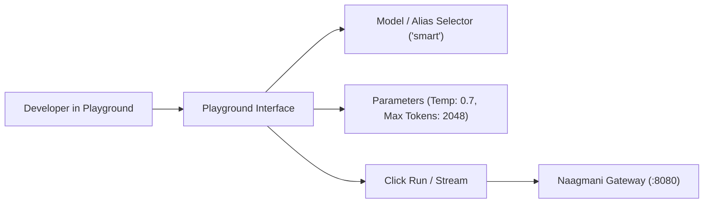

# Model Playground

Test foundation models and virtual routing policies directly within the Developer Portal without writing client code.

- **Portal Location**: `Projects > [Your Project] > Operations > Model Playground` (`/projects/[slug]/model-playground`)

---

## What is the Model Playground?

The **Model Playground** allows engineers and prompt designers to:
- Test raw foundation models (`gpt-4o`, `deepseek-chat`, `claude-3-5-sonnet`) side-by-side with virtual routing aliases (`smart`, `fast`).
- Fine-tune hyperparameters: `temperature`, `top_p`, `frequency_penalty`, `presence_penalty`, and `max_tokens`.
- Simulate streaming performance and measure real-time Time-To-First-Token (TTFT) latency.
- Export formatted cURL, TypeScript, or Python snippets based on your active playground settings.

---

## How to Use the Model Playground

1. In your project workspace, click **Operations > Model Playground**.
2. Select a target model or routing policy from the top dropdown.
3. Enter your **System Instructions** and **User Prompt**.
4. Adjust temperature and generation limits in the right settings drawer.
5. Click **Run** or press `Ctrl + Enter`.
6. Click **View Code** to copy production-ready SDK snippets.

---

## Related Documentation

- [Agent Playground](file:///e:/project/naagmani-project/naagmani-docs/docs/developer-portal/capabilities/agent-playground.md)
- [Smart Routing Policies](file:///e:/project/naagmani-project/naagmani-docs/docs/developer-portal/governance-routing/routing.md)
- [Chat Completions API](file:///e:/project/naagmani-project/naagmani-docs/docs/api/chat-completions.md)
