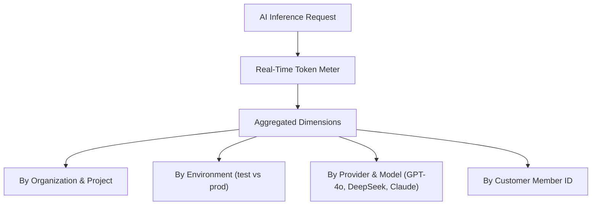

# Usage & Token Analytics

Monitor real-time token consumption, request throughput, latency trends, and compute costs across all organizations, projects, and environments.

- **Portal Location**: `Organization > Usage` (`/usage`) or `Projects > [Your Project] > Operations > Usage` (`/projects/[slug]/usage`)
- **API Endpoint**: `/v1/usage`

---

## What is Tracked in Usage?

Naagmani meters every token passing through the gateway in real time:

---

## Core Metrics & Visualizations

1. **Total Token Consumption**: Breakdown of Prompt (Input) Tokens vs Completion (Output) Tokens.
2. **Requests Per Minute (RPM) & Throughput**: Time-series charts showing peak load and concurrency.
3. **P50 / P95 / P99 Latency**: Gateway overhead and upstream Time-To-First-Token (TTFT) percentiles.
4. **Estimated Model Spend ($ USD)**: Dynamic cost calculation based on active upstream vendor price books.
5. **Model Distribution**: Proportional pie chart showing token volume split across models.

---

## Exporting Analytics Data

- **CSV / JSON Export**: Download raw usage logs directly from the portal table.
- **REST Telemetry API**: Query aggregate token counts programmatically via `GET /v1/usage`.

---

## Related Documentation

- [FinOps & Budget Controls](file:///e:/project/naagmani-project/naagmani-docs/docs/developer-portal/operations/budgets.md)
- [Provider Attempt Accounting](file:///e:/project/naagmani-project/naagmani-docs/docs/developer-portal/operations/attempts.md)
