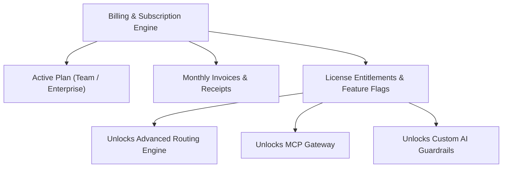

# Billing, Plans & Subscriptions

Manage organization subscription plans, payment methods, invoice histories, and license entitlements.

- **Portal Location**: `Organization > Billing` (`/billing`)
- **API Endpoint**: `/v1/billing`

---

## What is Managed in Billing?

1. **Subscription Plans**: Upgrade or downgrade tier plans (e.g. Free Developer, Team, Enterprise) based on concurrency limits, member seats, and advanced routing capabilities.
2. **Payment Methods**: Configure credit cards or bank accounts via integrated payment gateways.
3. **Invoices & Receipts**: Download PDF invoices and tax receipts for platform fees and prepaid token credits.
4. **License Entitlements**: View active feature flags (e.g., `advanced_routing`, `mcp`, `skills`, `firewall.custom_rules`).

---

## License Entitlements & Feature Gating

Certain enterprise capabilities require specific entitlements. When an entitlement is active, corresponding features automatically unlock in the Developer Portal and Gateway:

| Entitlement Capability | Description | Unlocked Portal Sections |
|---|---|---|
| `advanced_routing` | Lowest-cost & lowest-latency dynamic scoring cascades | `Routing Policies` |
| `mcp` | Model Context Protocol gateway and server connectors | `MCP Servers`, `MCP Policies` |
| `skills` | Custom domain skill instruction authoring | `Skills` |
| `plugins` | Sandboxed HDK plugin worker processes | `Plugins & Tools` |
| `firewall.custom_rules` | Custom regex and PII DLP inspection pipelines | `AI Guardrails` |

---

## Related Documentation

- [Organizations & Settings](file:///e:/project/naagmani-project/naagmani-docs/docs/developer-portal/organization/organizations.md)
- [FinOps & Budgets](file:///e:/project/naagmani-project/naagmani-docs/docs/developer-portal/operations/budgets.md)
