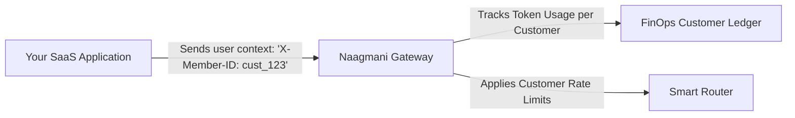

# Customer Members

Manage external customer identities, end-user tenants, and consumer accounts utilizing your AI applications.

- **Portal Location**: `Organization > Customer Members` (`/members`)
- **API Endpoint**: `/v1/members`

---

## What is a Customer Member?

While **Portal Users** represent internal staff with dashboard access, **Customer Members** represent end-users or external customer organizations calling your AI APIs.

Naagmani allows assigning distinct token usage budgets, rate limits, and metadata tags directly to customer member IDs (e.g. `cust_01J8F...`), providing per-customer unit economics.

---

## Member Attributes & Quotas

- **Member ID / Identifier**: Unique external ID (e.g., your customer's database ID or email).
- **Spending Ceiling**: Max monthly LLM token budget allocated to this customer.
- **Rate Limit**: Max Requests-Per-Minute (RPM) and Tokens-Per-Minute (TPM).
- **Metadata**: Custom key-value pairs (e.g. `tier: enterprise`, `country: US`).

---

## Related Documentation

- [Portal Users](file:///e:/project/naagmani-project/naagmani-docs/docs/developer-portal/organization/users.md)
- [FinOps & Budgets](file:///e:/project/naagmani-project/naagmani-docs/docs/developer-portal/operations/budgets.md)
