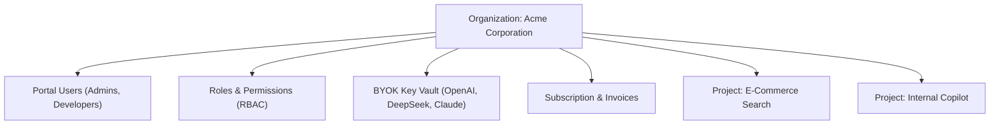

# Organizations & Tenant Hierarchy

An **Organization** is the top-level multi-tenant boundary in Naagmani. It acts as the legal and operational container for your enterprise account, managing billing, identity access, team memberships, and centralized AI provider connections.

- **Portal Location**: `Organization > Settings` (`/organizations/[organizationId]`)
- **API Endpoint**: `/v1/organizations`

---

## What is an Organization?

Every workload, team member, API key, and budget in Naagmani belongs to an Organization. Organizations provide complete tenant isolation:
- **Data Isolation**: Requests, audit logs, and prompt tokens cannot be viewed across different organizations.
- **BYOK Vault Isolation**: Upstream provider credentials (e.g. your OpenAI or Anthropic corporate accounts) are scoped to the organization.
- **FinOps Ledger**: Invoices, credit pools, and budget quotas aggregate at the organization level.

---

## Organization Structure & Scope

---

## Configuring Organizations in Developer Portal

### 1. General Settings
- **Organization Name**: The display name of your enterprise (e.g. `Acme Corp`).
- **Organization Slug**: A URL-friendly identifier used in CLI and API headers (e.g. `acme-corp`).
- **Primary Contact & Billing Email**: Target email for invoice receipts and critical security alerts.

### 2. Multi-Organization Switching
Developers who belong to multiple organizations (e.g. personal development vs client work) can switch contexts using the **Organization Selector** dropdown in the top navigation bar. Switching organizations instantly refreshes:
- Visible projects
- Available provider credentials
- Role permissions and billing access

---

## Related Documentation

- [Portal Users & Access](file:///e:/project/naagmani-project/naagmani-docs/docs/developer-portal/organization/users.md)
- [Roles & Permissions](file:///e:/project/naagmani-project/naagmani-docs/docs/developer-portal/organization/roles.md)
- [Providers & BYOK Vault](file:///e:/project/naagmani-project/naagmani-docs/docs/developer-portal/organization/providers.md)
