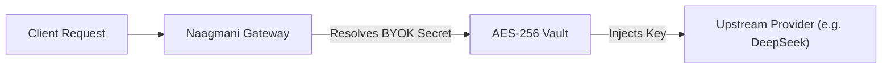
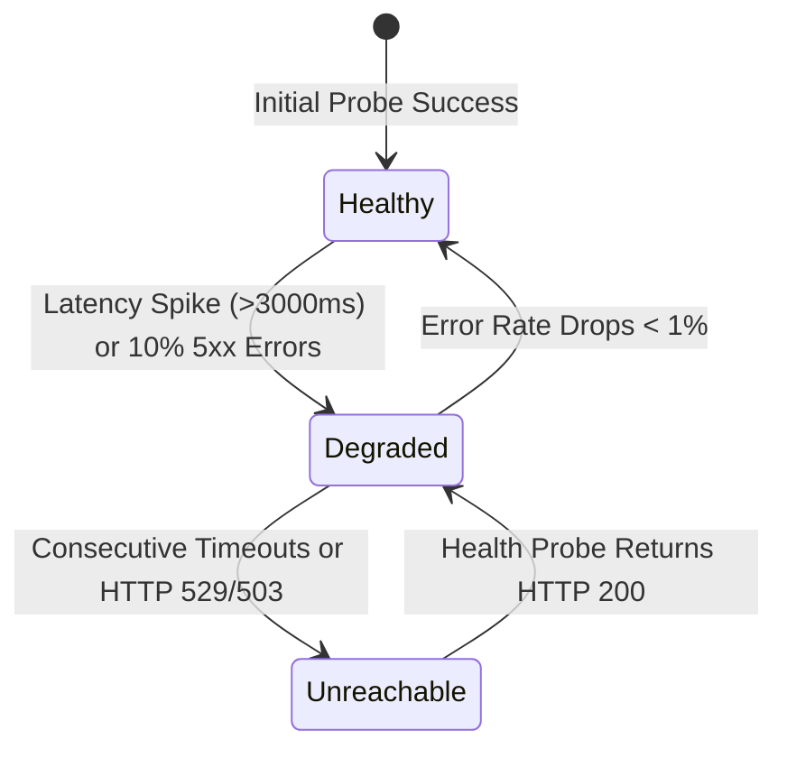

# Providers, BYOK Vault & Health Monitoring

Connect, encrypt, and monitor your upstream AI model providers in one unified Bring-Your-Own-Key (BYOK) credential management center.

- **Portal Location**: `Organization > Providers & Health` (`/providers`)
- **API Endpoint**: `/v1/providers`

---

## What is a Provider?

A **Provider** represents an upstream AI execution target, such as:
- **Cloud LLMs**: OpenAI, Anthropic, Google Gemini, DeepSeek, Groq, Mistral, Cohere.
- **Self-Hosted & Local LLMs**: Private vLLM instances, Ollama endpoints, or Text Generation Inference (TGI) servers.

Naagmani acts as a transparent reverse proxy. When a request arrives, Naagmani retrieves your encrypted provider credentials, formats the payload to match the upstream protocol, dispatches the call, and returns standard OpenAI-compatible responses.

---

## Supported Model Providers

| Provider | Supported Models | Connection Type | Special Capabilities |
|---|---|---|---|
| **DeepSeek** | `deepseek-chat` (V3), `deepseek-reasoner` (R1), `deepseek-v4-pro` | Cloud API / BYOK | Ultra-low-cost, reasoning traces, 1M context |
| **OpenAI** | `gpt-4o`, `gpt-4o-mini`, `o1`, `o3-mini`, `text-embedding-3-large` | Cloud API / BYOK | Structured outputs, vision, function calling |
| **Anthropic** | `claude-3-5-sonnet`, `claude-3-5-haiku`, `claude-3-opus` | Cloud API / BYOK | Extended context (200k), code generation |
| **Google Gemini** | `gemini-2.5-flash`, `gemini-2.5-pro`, `gemini-2.0-flash` | Cloud API / BYOK | Multimodal, long context (1M+ tokens) |
| **Self-Hosted** | `llama-3.3-70b`, `qwen-2.5`, `mistral-large` (via vLLM / Ollama) | Private HTTP / Custom Base URL | Air-gapped, zero data egress, on-prem |

---

## BYOK Security & Key Storage

When you connect a provider in the Developer Portal:
1. **AES-256-GCM Encryption**: Secrets are encrypted at rest using envelope encryption with hardware-backed KMS keys.
2. **Zero Plaintext Logging**: Provider keys are never written to disk, telemetry logs, or client responses.
3. **Scoped Resolution**: Secrets are injected only in memory at the exact moment of upstream dispatch.

---

## Real-Time Provider Health & Automated Degradation

Naagmani continuously monitors the availability and latency of all connected providers:

### Health Status Indicators:
- **🟢 Healthy**: Average TTFT < 1500ms, success rate > 99%. All routing policies dispatch to this provider normally.
- **🟡 Degraded**: High latency or intermittent 429 rate limits. Smart router automatically de-prioritizes candidate in weighted scoring.
- **🔴 Unreachable / Outage**: Provider is offline or experiencing an outage. Smart router immediately bypasses this provider and executes the failover cascade to the next healthy candidate.

---

## Connecting a Provider in Developer Portal

1. Navigate to **Organization > Providers & Health** (`/providers`).
2. Click **Connect Provider**.
3. Select your provider from the catalog.
4. Enter:
   - **Provider Name**: A descriptive label (e.g. `Corporate DeepSeek Account`).
   - **API Key**: The upstream secret token (e.g. `sk-ant-...`, `sk-proj-...`).
   - **Custom Base URL** *(Optional)*: Set for Azure OpenAI, private VPC endpoints, or local vLLM servers (e.g. `http://vllm.internal:8000/v1`).
5. Click **Test & Save**. Naagmani immediately sends an automated ping to verify connectivity.

---

## Troubleshooting Provider Connections

| Issue | Root Cause | Solution |
|---|---|---|
| **HTTP 401 Unauthorized** | The upstream provider API key is invalid or revoked. | Update the API key in `/providers` and verify billing on the upstream vendor portal. |
| **HTTP 429 Rate Limit** | Upstream account has hit Requests-Per-Minute (RPM) or Tier limit. | Configure a [Smart Routing Failover Cascade](file:///e:/project/naagmani-project/naagmani-docs/docs/developer-portal/governance-routing/routing.md) to automatically route excess traffic to a secondary provider. |
| **Connection Refused (vLLM/Ollama)** | Private model server is unreachable from the Naagmani gateway. | Verify network firewalls and ensure `Custom Base URL` is reachable via HTTP/HTTPS. |

---

## Related Documentation

- [Smart Routing Policies](file:///e:/project/naagmani-project/naagmani-docs/docs/developer-portal/governance-routing/routing.md)
- [Provider Attempt Accounting](file:///e:/project/naagmani-project/naagmani-docs/docs/developer-portal/operations/attempts.md)
- [API Models Endpoint](file:///e:/project/naagmani-project/naagmani-docs/docs/api/models.md)
