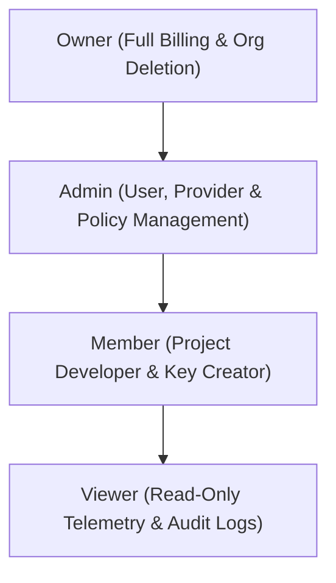

# Roles & Permissions (RBAC)

Naagmani implements a granular **Role-Based Access Control (RBAC)** model to enforce the principle of least privilege across organization assets.

- **Portal Location**: `Organization > Roles & Permissions` (`/roles`)
- **API Endpoint**: `/v1/roles`

---

## Standard Role Hierarchy

---

## Permission Matrix

| Capability / Resource | Owner | Admin | Member | Viewer |
|---|:---:|:---:|:---:|:---:|
| **Manage Billing & Subscriptions** | ✅ | ❌ | ❌ | ❌ |
| **Manage BYOK Upstream Providers** | ✅ | ✅ | ❌ | ❌ |
| **Invite / Remove Portal Users** | ✅ | ✅ | ❌ | ❌ |
| **Create & Rotate API Keys** | ✅ | ✅ | ✅ | ❌ |
| **Configure Routing Policies** | ✅ | ✅ | ✅ | ❌ |
| **Create AI Agents & Tools** | ✅ | ✅ | ✅ | ❌ |
| **Send Inference Requests via API** | ✅ | ✅ | ✅ | ❌ |
| **View Telemetry & Audit Logs** | ✅ | ✅ | ✅ | ✅ |

---

## Custom Roles & Capability Grants

For enterprise deployments requiring fine-grained policies, custom roles can be defined by bundling specific permission strings:
- `providers.read`, `providers.manage`
- `api_keys.read`, `api_keys.manage`
- `routing_policies.read`, `routing_policies.manage`
- `audit.read`
- `billing.read`, `billing.manage`

---

## Related Documentation

- [Organizations & Settings](file:///e:/project/naagmani-project/naagmani-docs/docs/developer-portal/organization/organizations.md)
- [Portal Users](file:///e:/project/naagmani-project/naagmani-docs/docs/developer-portal/organization/users.md)
