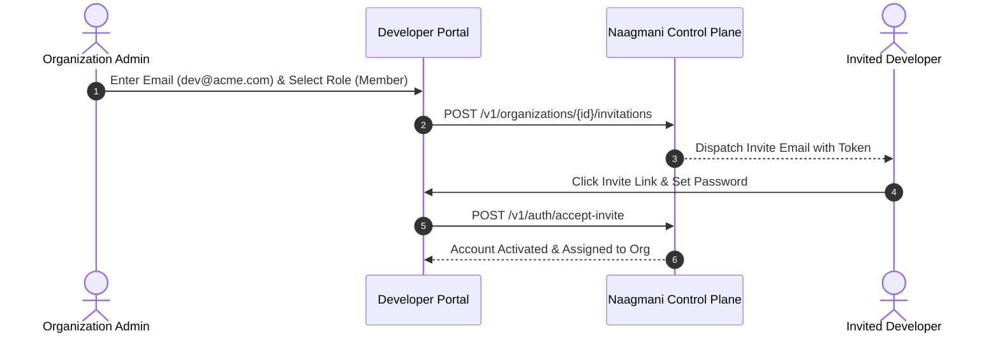

# Portal Users & Access

Manage developer logins, user invitations, and interactive portal authentication across your organization.

- **Portal Location**: `Organization > Portal Users` (`/users`)
- **API Endpoint**: `/v1/users`

---

## What are Portal Users?

**Portal Users** are human team members (engineers, product managers, security administrators, and finance managers) who log in to the Naagmani Developer Portal via email/password or SSO.

> [!NOTE]
> Portal Users differ from **Customer Members**: Portal Users access the administrative console, while Customer Members represent end-users of your AI applications.

---

## User Invitation Flow

---

## Managing Users in Developer Portal

1. Navigate to **Organization > Portal Users** (`/users`).
2. Click **Invite User**.
3. Specify the recipient's email address and select an initial **Role** (e.g. `Admin`, `Member`, `Billing Manager`).
4. Once accepted, you can:
   - Modify the user's role.
   - Force password reset.
   - Deactivate or remove the user from the organization.

---

## Related Documentation

- [Roles & Permissions (RBAC)](file:///e:/project/naagmani-project/naagmani-docs/docs/developer-portal/organization/roles.md)
- [Customer Members](file:///e:/project/naagmani-project/naagmani-docs/docs/developer-portal/organization/members.md)
