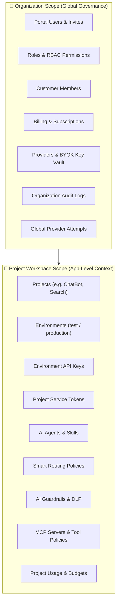
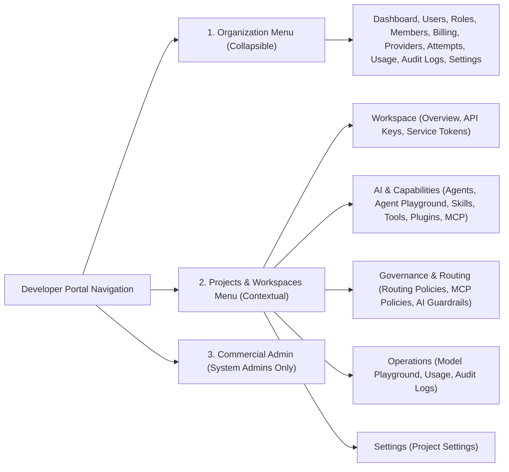
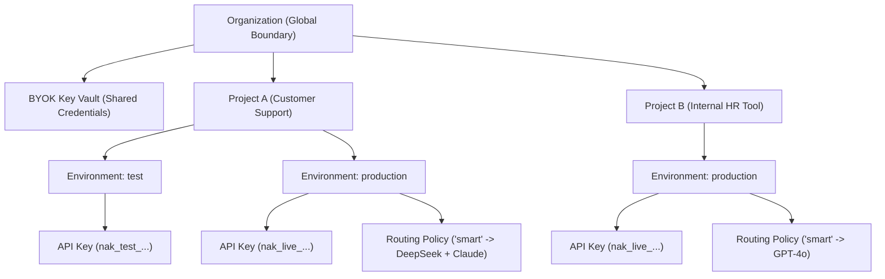

# Developer Portal Overview & Dual Scope Model

The **Naagmani Developer Portal** is the centralized graphical interface for managing your AI infrastructure, tenant hierarchies, security policies, and real-time observability.

---

## The Dual Scope Mental Model

To balance organization-wide governance with project-level autonomy, the Developer Portal is built around two distinct operational contexts:

---

## 1. Organization Scope vs Project Workspace

Understanding when to operate at the **Organization level** versus inside a **Project Workspace** is key to navigating the Developer Portal:

| Scope | What Lives Here? | Why This Scope Exists | Primary Audience |
|---|---|---|---|
| **Organization Scope** | • Global Provider BYOK Keys • Team Members & Roles (RBAC) • Billing & Subscription Plans • Organization Audit Logs • Marketplace & Publisher | Centralized enterprise governance, shared API key vaults, security compliance, and financial accounting across all company projects. | Org Owners, Security Admins, Finance / FinOps Leads |
| **Project Workspace Scope** | • Environment API Keys (`test`/`prod`) • Project Service Tokens • Smart Routing Rules & Cascades • AI Agents, Skills & Tools • MCP Servers & Policies • AI Guardrails (PII/DLP) • Model & Agent Playgrounds | Isolated developer workspace for building, configuring, and testing specific AI workloads without affecting sibling applications. | Software Engineers, AI Application Developers, Data Scientists |

---

## Dynamic Navigation in the Developer Portal

The left navigation sidebar automatically adapts based on your active context:

### Auto-Expanding Workspace Context
When you select an active project (e.g., `Projects > Customer Copilot`), the sidebar highlights the active project tag (`slug: customer-copilot`) and reveals project-specific sections:
- **Workspace**: Access keys and service tokens scoped strictly to that project.
- **AI & Capabilities**: Configure autonomous agents, skill prompts, tool JSON schemas, and MCP connectors.
- **Governance & Routing**: Define model cascades (`smart`, `fast`), failovers, and safety guardrails.
- **Operations**: Direct model testing playgrounds, token usage graphs, and project-specific audit trails.

---

## Resource Hierarchy & Scope Isolation

Resources in Naagmani strictly adhere to a 3-tier boundary:

1. **Strict Project Isolation**: API keys, service tokens, and routing policies created inside *Project A* cannot access or influence *Project B*.
2. **Environment Separation**: `test` environments maintain separate rate limits, token budgets, and test credentials from `production`.
3. **Inherited BYOK Credentials**: Projects seamlessly leverage organization-level upstream provider connections without developers needing raw provider secrets.

---

## Next Steps

Explore specific Developer Portal capabilities:
- [Organizations & Settings](file:///e:/project/naagmani-project/naagmani-docs/docs/developer-portal/organization/organizations.md)
- [Providers & BYOK Health](file:///e:/project/naagmani-project/naagmani-docs/docs/developer-portal/organization/providers.md)
- [Projects & Environments](file:///e:/project/naagmani-project/naagmani-docs/docs/developer-portal/projects/projects.md)
- [Smart Routing Policies](file:///e:/project/naagmani-project/naagmani-docs/docs/developer-portal/governance-routing/routing.md)
