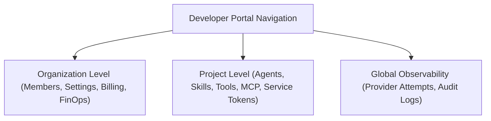

# Developer Portal Overview & Navigation

The **Naagmani Developer Portal** is the centralized web management console for managing AI infrastructure, credentials, routing policies, autonomous agents, and FinOps governance.

- **Local Development URL**: [{{DEVELOPER_PORTAL_URL}}]({{DEVELOPER_PORTAL_URL}})
- **Production Hosted URL**: [{{DEVELOPER_PORTAL_URL}}]({{DEVELOPER_PORTAL_URL}})

---

## Portal Navigation Layout

### 1. Top Navigation Bar
- **Organization Selector**: Switch between team organizations seamlessly.
- **Project Selector**: Choose your active project workspace.
- **Documentation & User Menu**: Quick access to documentation links and user profile settings.

### 2. Organization Sidebar (Global Scope)
- **Dashboard**: High-level platform health, aggregate token velocity, and active projects.
- **Projects**: Manage project workspaces across your company.
- **Members**: Manage team members, RBAC roles, and individual monthly spending caps.
- **Usage & FinOps**: Organization-wide token metering, budget limits, and cost analytics.
- **Provider Attempts**: Real-time upstream dispatch trace inspector and retry cascade logs.
- **Audit Logs**: Immutable security compliance event trail.

### 3. Project Sidebar (Scoped Workload)
- **Agents**: Autonomous AI assistants, system prompts, and tool bindings.
- **Agent Playground**: Interactive testbed for debugging agent reasoning steps and tool calls.
- **Skills & Tools**: Reusable prompt skills and custom HTTP/gRPC tool schemas.
- **MCP Servers & Policies**: External Model Context Protocol integrations and security guardrails.
- **Model Playground**: Side-by-side model comparison, latency benchmarking, and token accounting.
- **Service Tokens**: Scoped machine-to-machine credentials.

---

## Next Steps

- Manage team members: [Members & Access Control](members.md)
- Issue service tokens: [Project Service Tokens Guide](service-tokens.md)
- Build autonomous agents: [Autonomous Agents & Assistants](agents.md)
