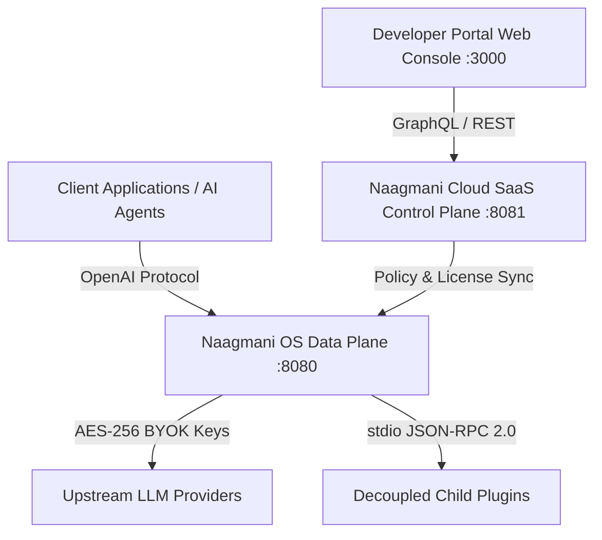

# Developer Portal Overview & Quickstart

Naagmani v1 operates as an "Android OS for AI" with strict separation of concerns between runtime execution and tenant control plane management.

---

## Architecture Topology

The Naagmani architecture is divided into three primary tiers:



### Core Components

1. **Naagmani OS (`:8080`)**:
   - High-performance Go data plane for OpenAI-compatible model routing.
   - BYOK credential resolution with AES-256-GCM encryption.
   - In-memory token bucket rate limiting and sliding window metrics.
   - Out-of-process plugin host communicating via JSON-RPC 2.0 over standard I/O (`stdio`).

2. **Naagmani Cloud (`:8081`)**:
   - SaaS control plane managing multi-tenant organization boundaries, teams, and environments.
   - Payment processing via Cashfree gateway integration.
   - Cryptographic license generation and verification.
   - Marketplace catalog distribution and plugin verification registry.

3. **Developer Portal (`:3000`)**:
   - Customer web console for managing API keys, providers, model routing policies, and usage metrics.
   - Project-based workspace isolation and environment switching (Production, Test).

---

## Getting Started

### 1. Launching the Backend Stack

Start the backend infrastructure (Naagmani OS, Naagmani Cloud, PostgreSQL, Redis, Mailpit) using Docker Compose:

```bash
# 1. Clone monorepo and start backend stack
docker compose up -d --build

# 2. Verify health endpoints
curl http://localhost:8080/v1/health
curl http://localhost:8081/health
```

### 2. Accessing the Developer Portal

Navigate to [http://localhost:3000](http://localhost:3000) to access the Developer Console:

- **Create Organization & Projects**: Configure your development environment.
- **Generate API Keys**: Obtain project-scoped API keys (`nm_live_...`).
- **Configure Model Providers**: Add OpenAI, Anthropic, Gemini, DeepSeek, or local Ollama credentials.
