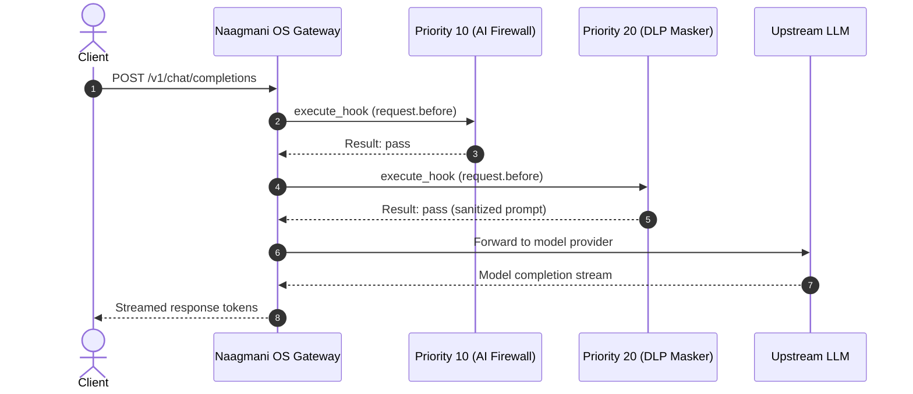

# Out-of-Process Plugin Protocol (v1)

Plugins in Naagmani execute as external child processes communicating with Naagmani OS via standard I/O (`stdin`/`stdout`) using the `naagmani.plugin/v1` JSON-RPC 2.0 wire protocol.

---

## Architecture & Priority Pipeline



---

## Plugin Execution Hooks

1. **Protocol Specification**: Frozen at `naagmani.plugin/v1`.
2. **Priority Ordering**: Lower numbers execute earlier in the pipeline (e.g., AI Firewall at Priority 10 before DLP Masker at Priority 20).
3. **Failure Modes**:
   - `fail_close`: Immediately halts the pipeline and rejects the request if the plugin crashes or encounters an unhandled error.
   - `fail_open`: Logs the error and bypasses the hook without interrupting user traffic.

---

## Example HDK Plugin Implementation

```typescript
import { Plugin, Result } from "@naagmani/hdk";

const plugin = new Plugin({
  name: "firewall",
  version: "1.0.0",
});

plugin.on("request.before", async (ctx) => {
  if (ctx.prompt.includes("DROP TABLE") || ctx.prompt.includes("UNION SELECT")) {
    return Result.block("SQL injection attack detected");
  }
  return Result.pass();
});

plugin.start();
```
