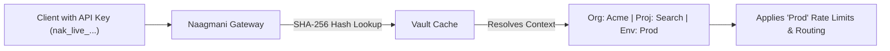

# API Keys & Credential Vault

**API Keys** are environment-scoped secrets used by client applications, scripts, and SDKs to authenticate inference requests with the Naagmani Gateway.

- **Portal Location**: `Projects > [Your Project] > Workspace > API Keys` (`/projects/[slug]/api-keys`)
- **API Endpoint**: `/v1/api-keys`

---

## What is an API Key?

An API Key is a high-entropy secret token tied to a specific **Project** and **Environment** (`test` or `production`). 

When an API Key is used in the `Authorization: Bearer <key>` header, Naagmani's gateway automatically resolves:
1. The caller's **Organization ID**.
2. The caller's **Project ID** and **Environment ID**.
3. The applicable **Routing Policies**, **Budget Limits**, and **AI Guardrails**.

---

## Key Format & Prefix Standards

Naagmani API Keys follow a strict prefix convention for security and automated secret scanning:

| Prefix | Environment | Purpose | Example |
|---|---|---|---|
| `nak_test_...` | Test / Staging | Development & CI/CD testing | `nak_test_8f7e6d5c4b3a2109...` |
| `nak_live_...` | Production | Live customer production traffic | `nak_live_1a2b3c4d5e6f7a8b...` |

---

## Security Architecture

1. **One-Way SHA-256 Hashing**: Plaintext keys are never stored in the database. Only cryptographic SHA-256 hashes are persisted.
2. **One-Time Plaintext Display**: The full secret is shown strictly once upon creation. If lost, the key must be rotated.
3. **Instant Revocation**: Revoking a key in the portal instantly purges it from the gateway's distributed Redis memory cache within < 50ms.

---

## Creating & Managing API Keys

1. Inside your active project workspace, click **Workspace > API Keys**.
2. Click **Generate API Key**.
3. Configure:
   - **Key Name**: A meaningful label (e.g. `Backend Chat Service`).
   - **Environment**: Select `test` or `production`.
   - **Rate Limit (RPM)** *(Optional)*: Set a dedicated Requests-Per-Minute cap for this specific key.
   - **Expiration** *(Optional)*: Set an automatic expiry date (e.g. 30 days, 90 days, or Never).
4. Click **Create Key** and copy the plaintext secret into your environment secrets manager.

---

## API Keys vs Project Service Tokens

| Feature | API Key (`nak_...`) | Project Service Token (`nsk_...`) |
|---|---|---|
| **Primary Use Case** | Application inference (`/v1/chat/completions`) | Machine-to-machine automation & granular capability scoping |
| **Capability Scopes** | Full inference access within target environment | Strict capability allowlists (`inference.execute`, `models.read`, etc.) |
| **Rotation Mechanism** | Manual delete & recreate | Automated zero-downtime rotation with configurable grace period |
| **Identity Context** | Project + Environment | Dedicated machine Service Principal + Project + Environment |

---

## Troubleshooting

| Error | Cause | Resolution |
|---|---|---|
| `401 Unauthorized: invalid api key` | Key string is mistyped or revoked. | Verify the key prefix (`nak_...`) and check key status in the Developer Portal. |
| `403 Forbidden: project quota exceeded` | The project has reached its monthly token budget. | Increase the project budget in **Usage & FinOps > Budgets**. |
| `429 Too Many Requests` | Key exceeded its configured RPM limit. | Upgrade rate limits or distribute requests across multiple keys. |

---

## Related Documentation

- [Project Service Tokens](file:///e:/project/naagmani-project/naagmani-docs/docs/developer-portal/projects/service-tokens.md)
- [API Authentication Reference](file:///e:/project/naagmani-project/naagmani-docs/docs/api/authentication.md)
