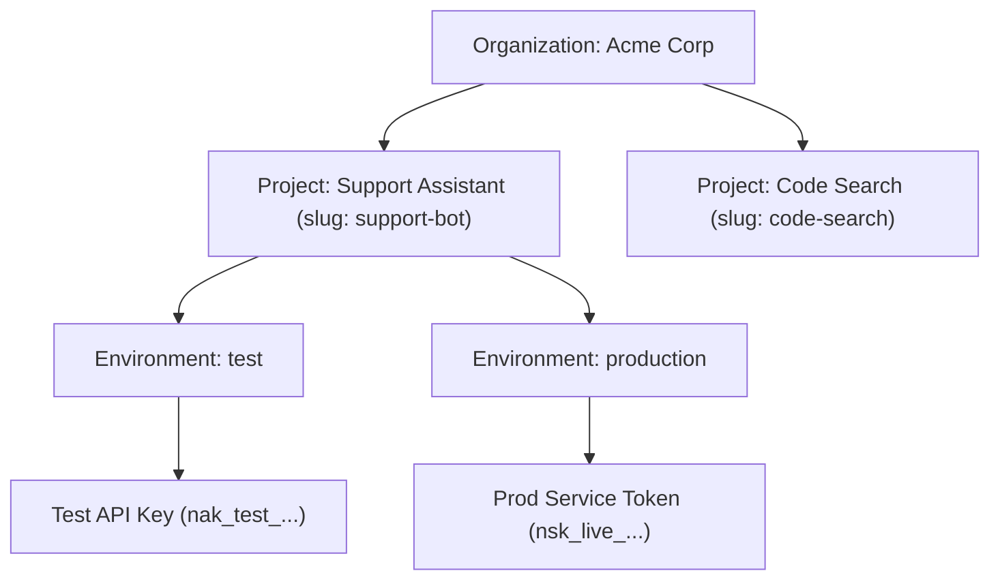

# Projects & Environments

A **Project** is an isolated workspace for a specific AI application, microservice, or product team. Each project contains multiple **Environments** (e.g. `test` and `production`) that provide complete runtime and credential isolation.

- **Portal Location**: `Projects & Workspaces > All Projects` (`/projects`)
- **API Endpoint**: `/v1/projects`

---

## What is a Project?

Projects allow dividing organization resources into independent workload boundaries:
- **Independent Credentials**: API keys and service tokens generated inside Project A cannot execute requests against Project B.
- **Dedicated Routing Rules**: Different applications can define their own model failovers and routing strategies.
- **Granular FinOps & Quotas**: Monthly token spend and rate limits can be partitioned per project.

---

## Environment Isolation

Every project comes pre-configured with two primary environments:

| Environment | Purpose | Key Prefix | Recommended Use |
|---|---|---|---|
| **`test`** | Staging, CI/CD automated testing, local development. | `nak_test_...` | Unlimited developer iterations with lower rate limits and debug logging enabled. |
| **`production`** | Live customer-facing traffic. | `nak_live_...` / `nsk_live_...` | High-availability routing cascades, strict budget ceilings, and immutable audit logging. |

---

## Configuring Projects in Developer Portal

1. Navigate to **Projects & Workspaces > All Projects** (`/projects`).
2. Click **New Project**.
3. Enter:
   - **Project Name**: e.g., `Customer Copilot`.
   - **Project Slug**: URL-safe identifier (e.g., `customer-copilot`).
   - **Description**: Purpose of this application workload.
4. Click **Create Project**. The Developer Portal will automatically switch into the newly created Project Workspace context.

---

## Related Documentation

- [API Keys & Vault](file:///e:/project/naagmani-project/naagmani-docs/docs/developer-portal/projects/api-keys.md)
- [Project Service Tokens](file:///e:/project/naagmani-project/naagmani-docs/docs/developer-portal/projects/service-tokens.md)
- [Smart Routing Policies](file:///e:/project/naagmani-project/naagmani-docs/docs/developer-portal/governance-routing/routing.md)
