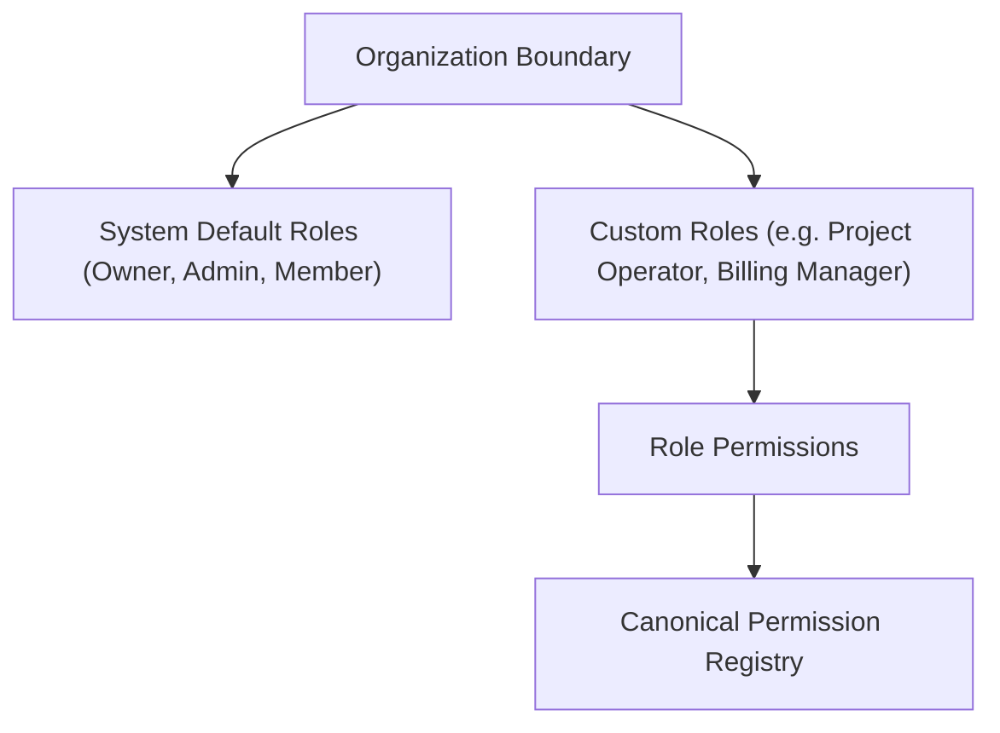

# Roles & Permissions (Dynamic RBAC)

The Naagmani Developer Portal features a dynamic, permission-based Role-Based Access Control (RBAC) foundation. Organizations can define custom roles tailored to specific operational responsibilities while utilizing platform-defined canonical permissions.

- **Portal Page**: [{{DEVELOPER_PORTAL_URL}}/roles]({{DEVELOPER_PORTAL_URL}}/roles)

---

## 1. System Defined vs Custom Roles

| Role Type | Description | Deletable | Customizable Permissions |
| :--- | :--- | :--- | :--- |
| **System Roles** (`owner`, `admin`, `member`) | Predefined platform roles automatically provisioned for every organization | ❌ No | ❌ Predefined |
| **Custom Roles** (e.g. `billing_manager`, `project_operator`) | Organization-scoped roles created by organization owners/admins | ✅ Yes (when unassigned) | ✅ Full permission selection |

---

## 2. Canonical Permissions

Canonical permissions represent granular business capabilities across all Naagmani subsystems:

- `organizations.read`, `organizations.manage`
- `users.read`, `users.invite`, `users.manage`
- `roles.read`, `roles.manage`
- `projects.read`, `projects.create`, `projects.update`, `projects.delete`, `projects.manage`
- `environments.read`, `environments.manage`
- `service_tokens.read`, `service_tokens.create`, `service_tokens.update`, `service_tokens.revoke`, `service_tokens.manage`
- `api_keys.read`, `api_keys.create`, `api_keys.revoke`, `api_keys.manage`
- `providers.read`, `providers.manage`
- `billing.read`, `billing.manage`
- `usage.read`
- `audit.read`
- `mcp.read`, `mcp.manage`
- `policies.read`, `policies.manage`
- `members.read`, `members.create`, `members.update`, `members.delete`, `members.manage`

---

## 3. Creating & Managing Custom Roles

1. Navigate to **Roles & Permissions** at [{{DEVELOPER_PORTAL_URL}}/roles]({{DEVELOPER_PORTAL_URL}}/roles).
2. Click **Create Custom Role**.
3. Specify a unique role identifier (e.g. `project_operator`), display name, and description.
4. Select the desired canonical permissions from the categorized registry.
5. Click **Create Role**.

---

## 4. Role Assignment & Safety Invariants

- **Multi-Tenant Isolation**: Custom roles created in Organization A exist solely within Organization A.
- **Protected Roles**: System roles cannot be deleted.
- **Assignment Protection**: Custom roles cannot be deleted while active Portal Users are assigned to them.
- **Sole Owner Safety**: Organizations cannot strip the Owner role from the sole remaining Owner.
- **Domain Boundaries**: Human RBAC applies strictly to human Portal Users (`User` + `OrganizationMembership`). Customer Members (`Member`, `mbr_...`) and machine credentials (PSTs and API keys) maintain completely independent authorization domains.

---

## Next Steps

- [Internal Portal Users](users.md)
- [Customer Members Directory](members.md)
- [Access Control & Security Architecture](../security/authorization.md)
