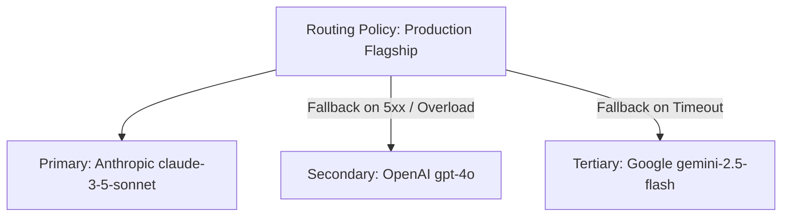

# Smart Routing Policies

Create visual routing rules and automated fallback cascades to ensure 99.99% availability and cost optimization for your AI workloads.

- **Portal Page**: `/projects/[projectId]/routing-policies`

---

## Creating a Routing Policy

1. Navigate to **Routing Policies** in your active Project.
2. Click **+ Create Routing Policy**.
3. Select a strategy:
   - **Priority Fallback Cascade**: Ordered list of models.
   - **Lowest Cost**: Dynamic routing to the lowest $/token provider.
   - **Lowest Latency**: Dynamic routing to the fastest TTFT provider.
4. Define health thresholds and cooldown timeouts.
5. Click **Deploy Policy**.

---

## Next Steps

- View execution traces: [Provider Attempt Accounting](attempts.md)
- Review FinOps controls: [FinOps & Budget Controls](finops-budgets.md)
