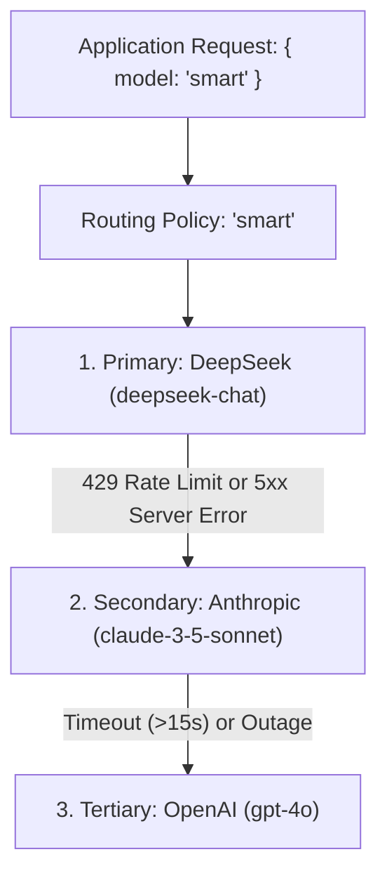

# Smart Routing Policies

Create visual routing rules, virtual model aliases (such as `smart`, `fast`, `economy`), and automated fallback cascades to ensure high availability and cost optimization for your AI applications.

- **Portal Location**: `Projects > [Your Project] > Routing Policies`
- **API Endpoint**: `/v1/projects/{projectId}/environments/{envId}/routing-policies`



---

## What is a Routing Policy?

A **Routing Policy** binds a virtual model alias name (e.g. `smart`, `production-flagship`, `auto-summary`) to one or more upstream AI provider targets, defining how requests should be routed, prioritized, balanced, and recovered during outages.

---

---

## Portal Options & Configuration Fields

When configuring a Routing Policy in the Developer Portal, the following fields are available:

### 1. General Settings
- **Policy Name / Alias** *(Required)*: The virtual alias name sent in API requests as the `model` parameter (e.g. `fast`, `smart`, `code-gen`).
- **Description** *(Optional)*: An internal description explaining the purpose of this policy.
- **Enable Policy Toggle**: Toggles whether the policy is active. If disabled, requests targeting this alias return an error.
- **Automatic Failover Toggle**: When enabled (recommended), failures on candidate $N$ automatically cascade to candidate $N+1$.

### 2. Strategy Selection (In Portal Order)
1. **Default (`default`)**: Deterministic single-provider execution. Directly targets the primary configured candidate without dynamic scoring.
2. **Priority (`priority`)**: Evaluates candidates sequentially in order of Priority (`1`, `2`, `3`...). Priority 1 is always executed first unless it encounters an outage or rate limit (HTTP 429/5xx/timeout).
3. **Failover (`failover`)**: Active-passive pairing. The primary candidate serves 100% of requests until degraded, at which point secondary standby candidates handle traffic.
4. **Weighted (`weighted`)**: Distributes traffic across candidates based on proportional weight percentages (e.g. 80% / 20%).
5. **Lowest Cost (`lowest_cost`)**: Dynamically routes to the candidate with the lowest $/1M token pricing calculated in real-time.
6. **Lowest Latency (`lowest_latency`)**: Dynamically routes to the candidate with the lowest TTFT (Time-To-First-Token) and lowest response time.

### 3. Candidate Management
- **Add Candidate Button**: Adds a new target row to the policy.
- **Provider Selector**: Choose from active registered providers (e.g., `deepseek`, `openai`, `anthropic`, `google`).
- **Model Selector**: Select any available model supported by that provider (e.g., `deepseek-v4-pro`, `deepseek-flash`, `gpt-4o`, `claude-3-5-sonnet`).
- **Priority Order**: Candidates are assigned priority indices based on their visual row order ($1$ is top priority, $2$ is secondary fallback, etc.).
- **Weight**: Configurable weight value for load balancing when using `weighted` strategy.
- **Remove Action**: Deletes a candidate row (policies must contain at least 1 candidate).

---

## Calling Your Policy via API

Once deployed, your client code simply uses the policy name as the `model` parameter:

```bash
curl -X POST https://api.naagmani.com/v1/chat/completions \
  -H "Content-Type: application/json" \
  -H "Authorization: Bearer nsk_live_YOUR_KEY" \
  -d '{
    "model": "smart",
    "messages": [
      {"role": "system", "content": "You are an enterprise AI assistant."},
      {"role": "user", "content": "Analyze system performance metrics."}
    ],
    "temperature": 0.5
  }'
```

---

## Fallback & Telemetry Observability

When a routing policy triggers a retry or fallback cascade:
- The execution trace is fully transparent and durable.
- In [Provider Attempt Accounting](attempts.md), you can inspect:
  - Total attempts dispatched (e.g. Attempt `Idx #0` failed with 429 $\rightarrow$ Attempt `Idx #1` succeeded).
  - TTFT and duration for each candidate.
  - Actual upstream provider cost and token accounting.

---

## Next Steps

- **Inspect Attempts**: [Provider Attempt Accounting Guide](attempts.md)
- **Concept Deep Dive**: [Smart Model Routing & Fallbacks](../concepts/routing.md)
- **Virtual Model Aliases**: [Models & Virtual Aliases](../concepts/models.md)
