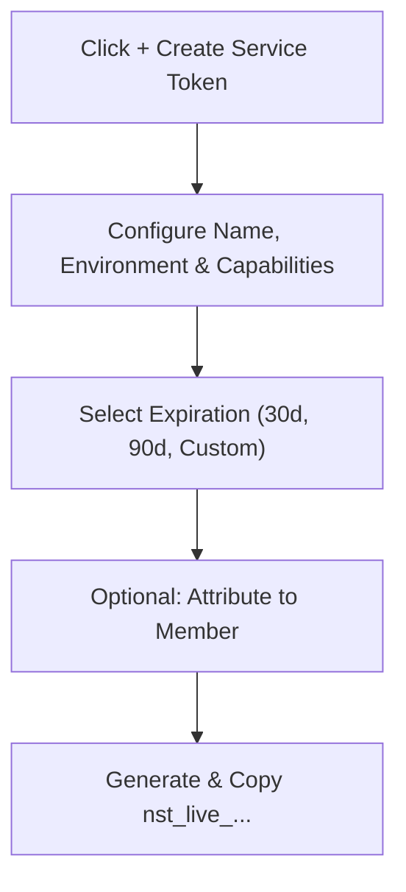

# Project Service Tokens Guide

Generate, scope, and manage machine-to-machine credentials for backend microservices and autonomous agents in the Developer Portal.

- **Portal Page**: `/projects/[projectId]/service-tokens` (e.g. [http://localhost:3000/projects](http://localhost:3000/projects))

---

## How to Create a Service Token

1. Open your target **Project** in the Developer Portal.
2. In the project sidebar, select **Service Tokens**.
3. Click the **+ Create Service Token** button.
4. Fill in the token configuration:
   - **Token Name**: A descriptive label (e.g. `order-processing-worker`).
   - **Environment**: Select `Development`, `Staging`, or `Production`.
   - **Capabilities**: Choose allowed operations (`inference:chat`, `tools:execute`, `mcp:access`).
   - **Expiration (TTL)**: Select a duration (30 days, 90 days, or Never Expire).
   - **Member Attribution**: Optionally link this token to an engineer for personal budget metering.
5. Click **Generate Token**.
6. Copy the issued token (`nst_live_...`) immediately.

---

## Revoking a Compromised Token

If a token is exposed or no longer needed:
1. Locate the token in the **Service Tokens** table.
2. Click the **Revoke** action button.
3. Confirm revocation. The token is immediately blocked across all gateway data planes.

---

## Next Steps

- Understand token mechanics: [Project Service Tokens Concept](../concepts/project-service-tokens.md)
- API Reference: [Service Tokens API](../api/service-tokens.md)
