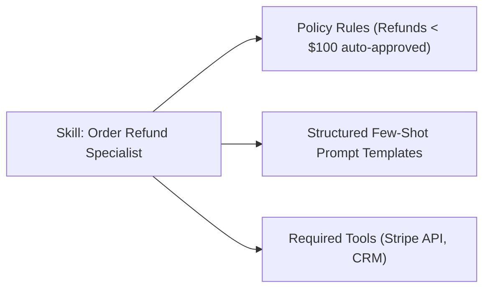

# Agent Skills & Orchestration

**Skills** are modular, reusable behavioral units that teach autonomous agents how to perform specialized workflows.

- **Portal Page**: `/projects/[projectId]/skills`

---

## Anatomy of a Skill

1. **Name & Identifier**: Unique slug (e.g. `customer-refund-workflow`).
2. **System Prompt Addendum**: Specialized instructions appended to the agent's base system prompt.
3. **Few-Shot Examples**: Representative input/output pairs demonstrating desired reasoning quality.
4. **Required Tool Capabilities**: List of tools that must be present for the skill to execute.

---

## Next Steps

- Register custom tools: [Tools & Working Flow](tools.md)
- Build agents: [Autonomous Agents & Assistants](agents.md)
