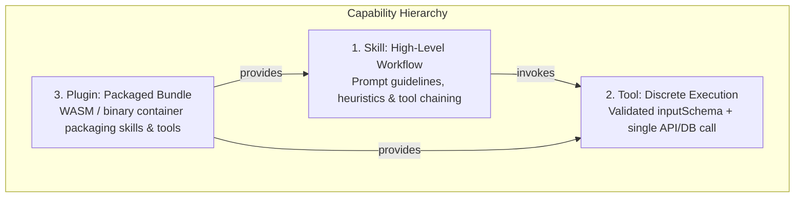

# Agent Skills & Orchestration

A **Skill** in Naagmani is a high-level cognitive capability configured at the agent level. Unlike a simple Tool (which executes a single deterministic function call), a Skill provides structured prompts, reasoning heuristics, domain knowledge, and multi-turn orchestration allowing an agent to solve complex enterprise workflows.

---

## 1. Capabilities Triad

- **Skill**: Defines *how* and *when* an agent reasons about a domain problem (e.g., *Customer Ticket Triage Skill*, *Cloud Incident Diagnostician*).
- **Tool**: Executable atomic action (e.g., `fetch_logs`, `restart_service`).
- **Plugin**: Shareable package containing tools and skills distributed across the enterprise.

---

## 2. Configuring Skills in the Developer Portal

In the **Naagmani Developer Console** (`http://localhost:3000`):

1. Navigate to **Projects** $\rightarrow$ `[Your Project]` $\rightarrow$ **Skills** (`/projects/[projectId]/skills`).
2. Click **Create Skill** or import one from the **Marketplace**.
3. Configure the following parameters:
   - **Name & Identifier**: Unique slug for referencing in agent loops.
   - **System Instructions**: Specific step-by-step guidance and domain heuristics.
   - **Required Tools**: Selected callable tools that this skill is permitted to invoke.
   - **Parameters & Input Constraints**: Strongly-typed arguments passed to the skill.
4. Test the skill interactively in the **Agent Playground**.

---

## 3. Related Documentation

- [Tools Architecture & Working Flow](./tools.md)
- [Agent Playground Guide](./agent-playground.md)
- [Model Context Protocol (MCP) Servers](./mcp-servers.md)
- [Plugin Protocol (v1)](./plugin-protocol.md)
