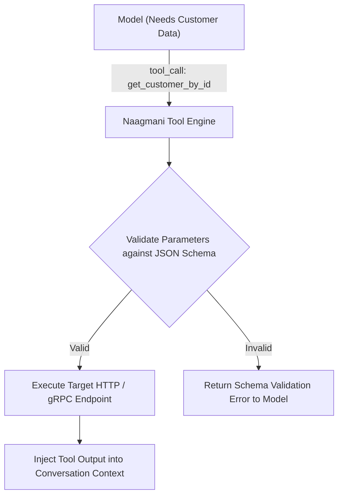

# Tools Architecture & Working Flow

**Tools** allow AI models and autonomous agents to interact with external databases, APIs, and microservices via standard JSON Schema function calling.

- **Portal Page**: `/projects/[projectId]/tools`



---

## Tool Definition Format

Every tool in Naagmani is defined with standard JSON Schema parameter specifications:

```json
{
  "name": "fetch_user_account",
  "description": "Fetches a user account and subscription status by email.",
  "parameters": {
    "type": "object",
    "properties": {
      "email": {
        "type": "string",
        "format": "email",
        "description": "The user's registered email address."
      },
      "include_billing": {
        "type": "boolean",
        "description": "Whether to return active subscription and invoice history."
      }
    },
    "required": ["email"]
  },
  "endpoint": {
    "url": "https://internal-api.example.com/v1/users",
    "method": "POST"
  }
}
```

---

## Next Steps

- Integrate Model Context Protocol: [MCP Servers & Transports](mcp-servers.md)
- Enforce tool access policies: [MCP Tool Policies](mcp-policies.md)
