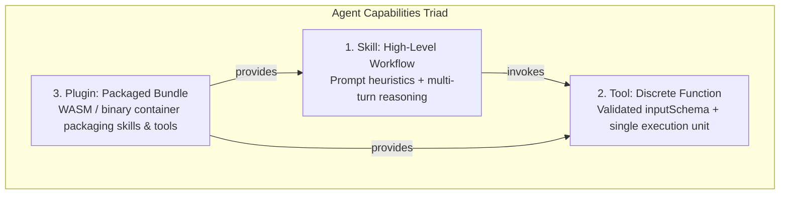
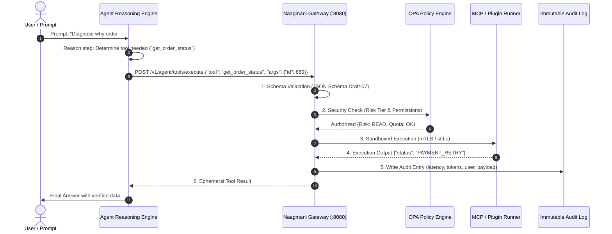

# Tools Architecture & Working Flow

A **Tool** in Naagmani is a discrete, executable function with a strictly validated JSON Schema contract that an agent can invoke during its autonomous reasoning loop. Tools bridge AI models with enterprise databases, APIs, code repositories, and external SaaS services.

---

## 1. Capabilities Triad: Skills vs Tools vs Plugins

Naagmani enforces a clear separation of concerns between capability types:

- **Skill**: Cognitive capability (e.g. *Database Performance Diagnostician*). Configured at the Agent prompt level.
- **Tool**: Single callable function (e.g. `pg_explain_query`). Discovered dynamically via MCP or Plugins.
- **Plugin**: Packaged bundle distributed via the Naagmani Marketplace containing tools, runners, and configuration schemas.

---

## 2. Complete Tool Working Flow & Runtime Lifecycle

When an AI agent executes a tool in Naagmani, the runtime follows an enterprise-grade 6-stage lifecycle:

### The 6 Stages Explained:

1. **Tool Discovery & Registration**:
   - Tools are registered in the project's Tool Registry via MCP Server discovery (`tools.list`), installed Marketplace plugins, or native platform functions.
2. **Dynamic Prompt Injection**:
   - When an agent initializes, only tools explicitly permitted for its role and project environment are compiled into OpenAI/Anthropic/Gemini function-calling format and injected into the model context.
3. **Model Function Invocation**:
   - The LLM emits structured tool call arguments (e.g. `call: get_order_status({ id: 889 })`).
4. **Policy Enforcement & Non-Escalation Gate**:
   - The Naagmani Gateway intercepts the call. It verifies input types against the schema, confirms risk tier permissions, and enforces FinOps tenant budgets before any downstream traffic is sent.
5. **Sandboxed Dispatch**:
   - The tool is executed in an isolated runner (Streamable HTTP, SSE, or sandboxed child process). Downstream services never see customer master API keys; credentials are automatically injected by the Gateway.
6. **Ephemeral Result & Audit Trail**:
   - Execution memory is ephemeral and scoped strictly to the current run. Full telemetry (request parameters, execution latency, response codes, tokens consumed) is committed to the tenant's immutable Audit Log.

---

## 3. Tool Security Risk Classification

Every tool registered in Naagmani must be assigned an explicit **Risk Tier**:

| Risk Tier | Label | Behavior & Security Controls | Example |
| :--- | :--- | :--- | :--- |
| `READ` | Safe | Read-only, idempotent, and side-effect free. Can be executed autonomously without human confirmation. | `get_user_profile`, `query_metrics`, `search_docs` |
| `WRITE` | Moderate | Creates or mutates state in non-critical systems. Requires explicit project permission. | `create_jira_issue`, `post_slack_message`, `update_record` |
| `DESTRUCTIVE` | High | Permanently modifies, drops, or terminates resources. Requires Human-in-the-Loop (HITL) approval. | `delete_database`, `terminate_pod`, `revoke_access` |
| `EXTERNAL_SIDE_EFFECT` | Sensitive | Triggers external billing, sends emails to customers, or invokes third-party webhooks. | `charge_credit_card`, `send_broadcast_email` |

---

## 4. Managing Tools in Developer Portal

In the **Naagmani Developer Console** (`http://localhost:3000`):

1. **Navigate to Tools Registry**:
   - Open your project workspace $\rightarrow$ **AI & Capabilities** $\rightarrow$ **Tools** (`/projects/[projectId]/tools`).
2. **Inspect Tool Schemas**:
   - View parameter schemas, required fields, and assigned risk tiers.
3. **Discover Tools via MCP**:
   - Click **Discover via MCP** to link external servers. Any exposed tools will automatically populate the registry.
4. **Test in Agent Playground**:
   - Open the **Agent Playground** to interactively test tool invocations and observe schema validation live.

---

## 5. Related Documentation

- [MCP Servers & Transports](./mcp-servers.md)
- [Model Context Protocol Integration](./mcp-integration.md)
- [Plugin Protocol (v1)](./plugin-protocol.md)
- [FinOps & Budget Controls](./finops-budgets.md)
