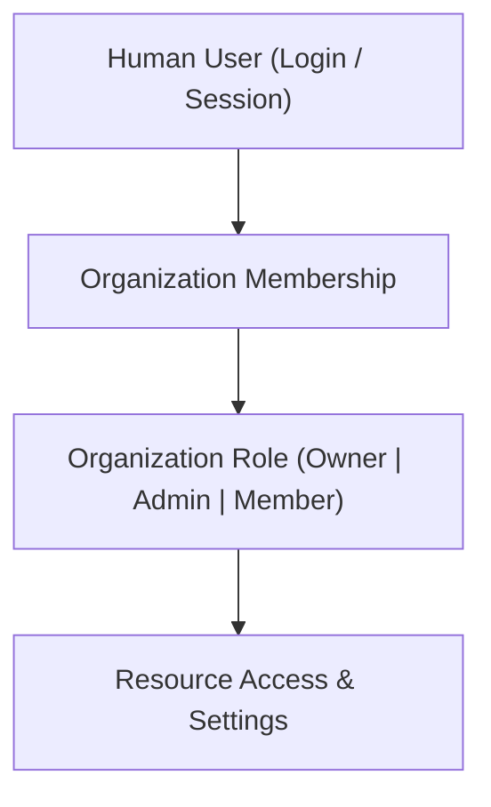

# Internal Developer Portal Users

Internal Developer Portal Users are human team members and administrators who have access to log into the Naagmani Developer Portal and manage an organization's resources.

- **Portal Page**: [{{DEVELOPER_PORTAL_URL}}/users]({{DEVELOPER_PORTAL_URL}}/users)

---

## Organization Roles

| Role | Intended For | Permissions & Scope |
| :--- | :--- | :--- |
| **Owner** | Organization Owners & Billing Managers | Full administrative control, subscription & billing management, user invitations, role changes, organization deletion. |
| **Admin** | Engineering Leads & DevOps | Create and manage projects, environments, service tokens, API keys, AI guardrails, routing policies. |
| **Member** | Engineers & Developers | Access projects, run model playgrounds, test MCP servers and plugins, view request logs. |

---

## Inviting & Managing Portal Users

1. Navigate to the **Portal Users** page at [{{DEVELOPER_PORTAL_URL}}/users]({{DEVELOPER_PORTAL_URL}}/users).
2. Click **Invite Portal User**.
3. Enter the email address of the team member.
4. Select the desired role (`Owner`, `Admin`, `Member`).
5. Click **Send Invitation**.

> [!NOTE]
> **Role Modification & Removal**  
> Organization **Owners** can change user roles or remove users from the organization at any time using the action buttons in the user row.

---

## Domain Isolation Rules

> [!IMPORTANT]
> - **Portal Users do not automatically receive machine credentials**: Inviting a portal user does not generate API keys, Project Service Tokens, or Customer Member directory records.
> - **Customer Members do not have portal access**: End-customer identities in the [Customer Members Directory](members.md) cannot log into the Developer Portal.

---

## Next Steps

- [Customer Members Directory](members.md)
- [Access Control & Authorization](../security/authorization.md)
- [Project Service Tokens](service-tokens.md)
