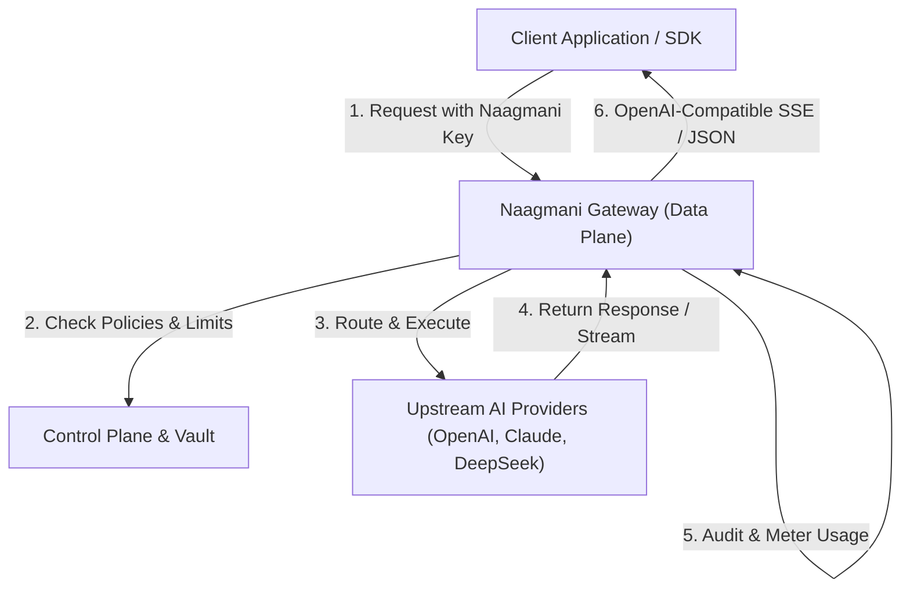
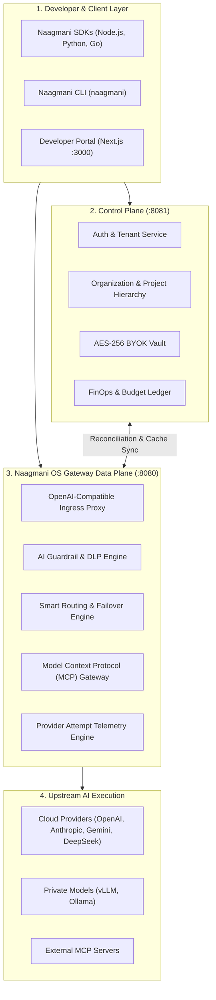
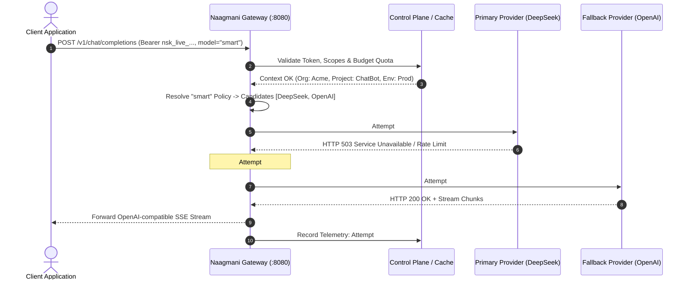
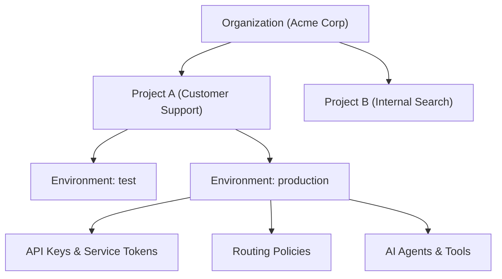

# How Naagmani Works

Naagmani operates as a high-performance **Control Plane & Data Plane architecture**, providing a centralized gateway between your client applications and upstream AI infrastructure.

---

## The Mental Model

At its simplest, Naagmani replaces direct third-party API calls with an intelligent, governed proxy layer:

---

## Architectural Planes: Control vs Data Plane

Naagmani strictly separates configuration management from real-time request processing to guarantee sub-millisecond overhead and high availability:

### 1. Control Plane (`naagmani-cloud` :8081)
- Manages organizations, projects, environments, and team member roles.
- Encrypts and manages upstream credentials in the BYOK vault.
- Maintains billing subscriptions, price books, quotas, and budget ledgers.
- Emits configuration snapshots and updates to the active gateway data plane.

### 2. Data Plane Gateway (`naagmani-os` :8080)
- Exposes standard OpenAI-compatible endpoints (`/v1/chat/completions`, `/v1/embeddings`, `/v1/responses`).
- Performs sub-millisecond authentication and rate limit verification against Redis memory caches.
- Executes the **Smart Routing cascade**, dynamically selecting the healthiest, lowest-cost, or lowest-latency model candidate.
- Runs **AI Guardrails** (prompt injection detection, PII masking).
- Logs **Provider Attempts** telemetry capturing latency, upstream status codes, token usage, and retry hops.

---

## The Request Lifecycle

When your application sends an AI inference request:

1. **Authentication & Ingress**: The gateway verifies the Bearer token (API Key or Project Service Token) and resolves the target Project and Environment.
2. **Budget & Rate Limit Check**: Token buckets and monthly spend limits are checked in-memory.
3. **Policy Resolution**: Virtual model aliases (e.g., `smart`) are mapped to active candidate lists.
4. **Upstream Dispatch & Failover**: The request is routed to Candidate #1. If it encounters a timeout, 429, or 5xx server error, the gateway seamlessly fails over to Candidate #2 without client disconnection.
5. **Telemetry & Metering**: Both attempts are recorded with exact latency, token counts, and upstream response metadata.

---

## Canonical Resource Hierarchy

Naagmani organizes all resources into a clean 3-tier structure:

- **Organization**: Top-level tenant container owning billing, user roles, customer members, and global provider credentials (BYOK).
- **Project**: Isolated workspace container for a specific application, service, or team.
- **Environment**: Strict runtime isolation boundary (e.g. `test`, `production`) owning scoped credentials, routing rules, agents, and usage telemetry.

---

## Next Steps

- Get started with your first project: [Quickstart Guide](file:///e:/project/naagmani-project/naagmani-docs/docs/get-started/quickstart.md)
- Learn how to send inference requests: [Make Your First AI Request](file:///e:/project/naagmani-project/naagmani-docs/docs/get-started/first-request.md)
- Explore the Developer Portal: [Developer Portal Overview](file:///e:/project/naagmani-project/naagmani-docs/docs/developer-portal/overview.md)
