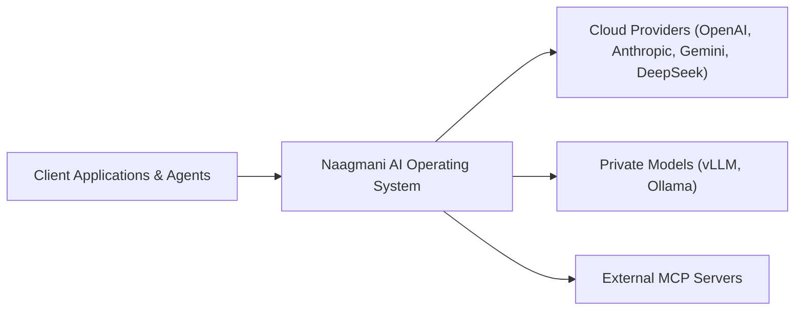
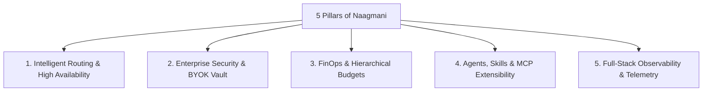

# What is Naagmani?

Naagmani is the open-source **AI Operating System and Enterprise Control Plane** designed to govern, route, observe, and extend large language model (LLM) workloads across hybrid multi-model infrastructure.

---

## Core Mission: Why Naagmani?

Modern software architectures face critical challenges when scaling AI applications to production:

1. **Provider Outages & Rate Limits**: Relying on a single AI provider leads to service disruptions during upstream outages or HTTP 429 rate limit spikes.
2. **Sprawling API Keys & Security Risks**: Embedding raw third-party provider keys in microservices creates credential leakage and audit compliance risks.
3. **Runaway LLM Spend**: Without centralized budget ceilings, token quotas, and cost-aware routing, AI costs spiral unpredictably.
4. **Lack of Standard Governance**: Teams lack unified policy enforcement for Data Loss Prevention (PII masking), content moderation, and tool execution approval.
5. **Ecosystem Lock-In**: Expanding agent capabilities with custom tools and external Model Context Protocol (MCP) servers requires bespoke glue code for every application.

Naagmani solves these challenges by providing a **unified OpenAI-compatible AI gateway and developer portal** that decouples your applications from underlying model providers.

---

## The 5 Pillars of Naagmani

### 1. Intelligent Routing & High Availability
Define virtual model aliases (e.g., `smart`, `fast`, `code-gen`) backed by multi-provider cascade policies. Naagmani dynamically selects the optimal model using strategies like **Lowest Latency**, **Lowest Cost**, **Priority**, or **Weighted Proportions**, automatically failing over to standby providers within milliseconds during outages or rate limits.

### 2. Enterprise Security & BYOK Vault
Store your upstream provider API keys securely in an AES-256 encrypted Bring-Your-Own-Key (BYOK) vault. Client applications authenticate using scoped **API Keys** or **Project Service Tokens**, ensuring raw provider credentials never leave the gateway perimeter.

### 3. FinOps & Hierarchical Budgets
Enforce strict budget ceilings, hard/soft spending thresholds, and rate limits across Organizations, Projects, and Environments. Real-time token metering tracks exact prompt and completion costs per request.

### 4. Agents, Skills & MCP Extensibility
Orchestrate autonomous AI agents equipped with reusable instruction **Skills**, JSON-schema **Tools**, and external **Model Context Protocol (MCP)** servers with fine-grained human-in-the-loop approval policies.

### 5. Full-Stack Observability & Telemetry
Inspect hop-by-hop execution traces through **Provider Attempt Accounting**. Every upstream attempt, latency metric, fallback trigger, and prompt token count is recorded in an immutable audit ledger.

---

## How Developers Interact with Naagmani

The platform is designed around four unified touchpoints:

| Touchpoint | Primary Purpose | Interface |
|---|---|---|
| **Developer Portal** | Configure organizations, projects, providers, routing policies, guardrails, and monitor analytics. | Web UI (`:3000`) |
| **Unified API** | Dispatch OpenAI-compatible chat completions, responses, and embeddings. | REST & SSE (`:8080`) |
| **Marketplace & HDK** | Discover capabilities or build custom plugins and tool extensions. | Host Development Kit |
| **Naagmani CLI** | Manage local dev workflows, validate manifests, run diagnostics, and automate CI/CD. | Command Line (`naagmani`) |

---

## Next Steps

- Understand the architectural mental model: [How Naagmani Works](file:///e:/project/naagmani-project/naagmani-docs/docs/get-started/how-it-works.md)
- Set up your first project and credentials: [Quickstart Guide](file:///e:/project/naagmani-project/naagmani-docs/docs/get-started/quickstart.md)
- Send your first inference request: [Make Your First AI Request](file:///e:/project/naagmani-project/naagmani-docs/docs/get-started/first-request.md)
