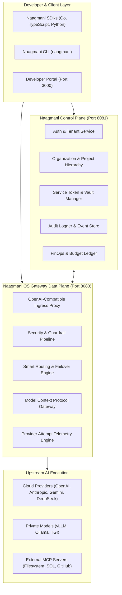
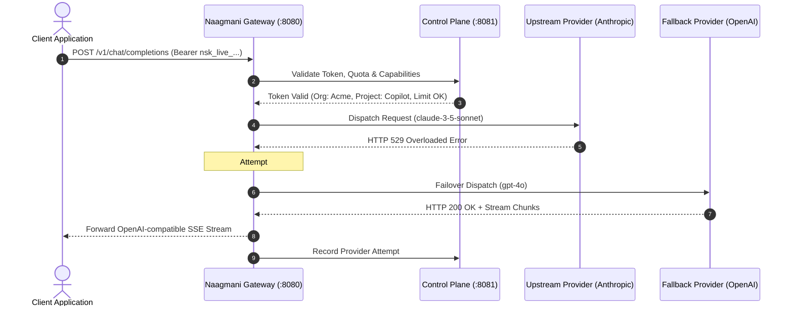

# Product Architecture

Naagmani is architected as a high-throughput, decoupled platform split cleanly across a **Control Plane**, a **Data Plane Gateway**, and an **Observability & Management Suite**.

---

## Architectural Planes

### 1. Data Plane Gateway (`naagmani-os`)
- **Port**: `8080` (Default Gateway Port)
- **Role**: Ultra-low-latency reverse proxy executing prompt translation, SSE streaming accumulation, routing failovers, guardrail filters, and MCP tool orchestration.
- **Performance**: Written in Go with sub-millisecond dispatch overhead.

### 2. Control Plane (`naagmani-cloud`)
- **Port**: `8081` (Cloud API Port)
- **Role**: Authoritative state management for Organizations, Projects, Environments, Members, BYOK Vault secrets, Service Token issuance, and FinOps budget ledgers.
- **Storage**: Backed by PostgreSQL and Redis for fast token validation and rate limiting.

### 3. Developer Portal (`naagmani-developer`)
- **Port**: `3000` (Web Console)
- **Role**: Premium web console for managing API keys, service tokens, routing policies, provider attempts trace inspector, and interactive playgrounds.

---

## Request Lifecycle

---

## Next Steps

- Review core entities: [Foundational Concepts](concepts.md)
- Follow the hands-on tutorial: [Quickstart Guide](../quickstart/overview.md)
