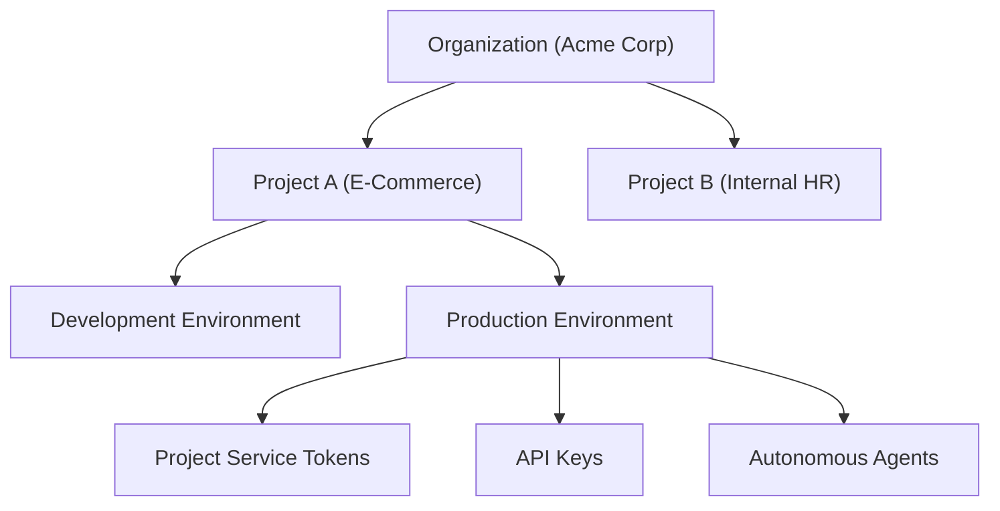

# Foundational Concepts

Before integrating Naagmani into your codebase, familiarize yourself with these core concepts:

---

## Core Vocabulary

### 1. Organization
The top-level root account representing your company or team. Governs billing, enterprise membership, global guardrails, and compliance logs.

### 2. Project
A logical workspace dedicated to a specific application or product line. Projects isolate credentials, routing policies, tools, and agents from other teams.

### 3. Environment
An execution boundary inside a project (e.g. `Development`, `Staging`, `Production`). Environments allow teams to safely test experimental model weights without affecting production workloads.

### 4. Project Service Token (`nst_...`)
A specialized machine-to-machine credential bound to a project and environment. Supports fine-grained capability matrices (e.g., `inference:chat`, `tools:execute`), TTL expiration, and human member attribution.

### 5. Smart Model Routing
An automated policy engine that dynamically routes inference requests across foundational model providers based on cost optimization, latency thresholds, or fallback priority chains.

### 6. Provider Attempt
A discrete unit of upstream execution telemetry. If a request experiences 2 failovers before succeeding, Naagmani records 3 discrete attempts, detailing latency, tokens, cost, and upstream error reasons for each hop.

### 7. Model Context Protocol (MCP)
An open protocol enabling AI models to safely access tools, filesystems, and databases. Naagmani acts as a secure MCP gateway, enforcing permissions and audit logging on every tool invocation.

---

## Progressive Learning Path

| Step | Topic | Link |
| :--- | :--- | :--- |
| **1** | Get started in 5 minutes | [Quickstart Overview](../quickstart/overview.md) |
| **2** | Send your first AI request | [First Request](../quickstart/first-request.md) |
| **3** | Deep dive into tenancy | [Organizations & Projects](../concepts/organizations.md) |
| **4** | Secure your infrastructure | [Project Service Tokens](../concepts/project-service-tokens.md) |
| **5** | Master the web console | [Developer Portal Guide](../developer-portal/overview.md) |
| **6** | Build autonomous agents | [Agent & MCP Guide](../developer-portal/agents.md) |
