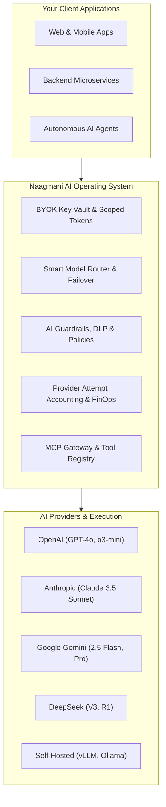

# What is Naagmani?

**Naagmani** is an enterprise-grade **AI Operating System & Gateway Runtime** designed to govern, optimize, and secure all Large Language Model (LLM) traffic across your engineering ecosystem.

Often described as the **"Android OS for AI"**, Naagmani acts as a centralized intelligent runtime layer between your application code and the fragmented landscape of foundational model providers (OpenAI, Anthropic Claude, Google Gemini, DeepSeek, and self-hosted open-source models).

---

## Why Do You Need an AI Operating System?

Building modern AI applications directly against individual provider APIs introduces critical enterprise bottlenecks:

| Challenge with Direct Provider Calls | How Naagmani Solves It |
| :--- | :--- |
| **Provider Lock-In & Breaking Changes** | Unified OpenAI-compatible API format across all providers. Switch models with zero code changes. |
| **Outages & Rate Limit Disruptions** | Automatic retry cascades and dynamic failover across providers in under 50ms. |
| **Sprawling API Keys & Security Risks** | Centralized Bring-Your-Own-Key (BYOK) encrypted vault and scoped Project Service Tokens. |
| **Runaway Costs & Unpredictable Bills** | Hierarchical FinOps spending caps (Organization $\rightarrow$ Project $\rightarrow$ Member) with real-time token tracking. |
| **Tool Calling & Agent Fragmentation** | Native Model Context Protocol (MCP) server integration and tool execution sandboxing. |

---

## The Naagmani Mental Model

To understand how Naagmani organizes workloads, consider the following structural hierarchy:

1. **Organization**: The top-level account and billing tenant (e.g. Acme Corp). Governs aggregate spending limits, team members, and enterprise audit logs.
2. **Project**: An isolated application or business initiative (e.g. *Customer Support Bot*, *Internal Copilot*).
3. **Environment**: Deployment stages within a project (*Test* and *Production*) with segregated secrets, routing rules, and rate limits.
4. **Service Tokens & API Keys**: Scoped credentials issued to services or developers with explicit capability matrices and optional member attribution.
5. **Smart Routing & Attempts**: Intelligent multi-hop dispatch engine that executes upstream provider calls, logs durable latency and token accounting, and handles failovers automatically.

---

## Next Steps

- Explore the business and engineering rationale: [Why Naagmani?](why-naagmani.md)
- Learn about the multi-plane system architecture: [Architecture Overview](architecture.md)
- Send your first AI request in under 3 minutes: [Quickstart Guide](../quickstart/first-request.md)
- Access the web management console: [Developer Portal Overview](../developer-portal/overview.md)
