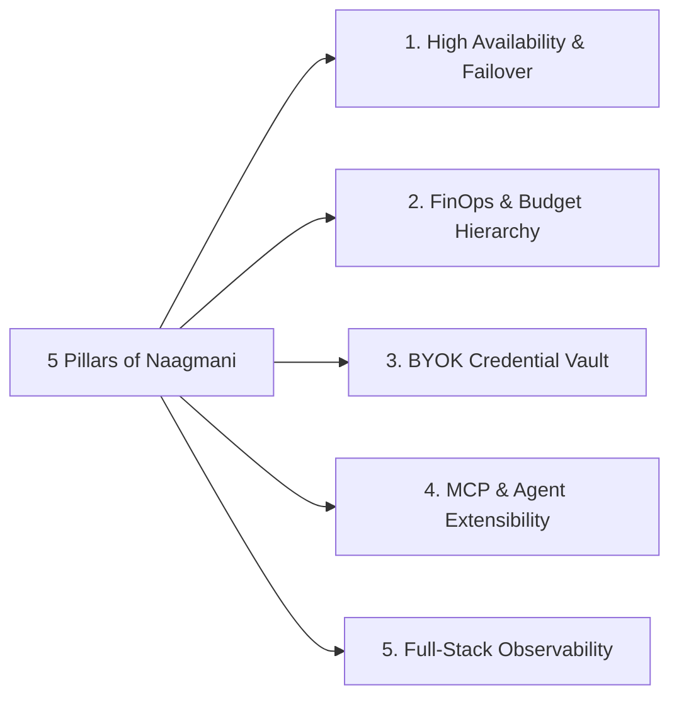

# Why Naagmani?

Modern software engineering teams are transitioning from single-model prototypes to complex multi-model, multi-agent production systems. However, managing raw provider connections at scale introduces severe operational overhead.

Naagmani provides the **Five Core Pillars** of enterprise AI infrastructure:

---

## 1. Zero-Downtime Reliability & Failovers

When foundational model providers suffer API outages, elevated 5xx error rates, or capacity throttling (HTTP 429 / 529), direct client applications break.

With Naagmani:
- **Intelligent Cascade Routing**: If Anthropic Claude returns an `OVERLOADED` error, Naagmani instantly routes the prompt to OpenAI GPT-4o or Google Gemini with zero application code changes.
- **Provider Health Probing**: Background probes monitor upstream provider latency and error rates, proactively routing traffic away from degraded regions.
- **Sub-50ms Failover Overhead**: Retries happen at the gateway layer, preserving client connections and streaming pipelines.

---

## 2. Granular FinOps & Multi-Tier Spending Caps

AI infrastructure spending can spiral rapidly without strict enforcement. Naagmani implements an authoritative 3-tier budget hierarchy:

1. **Organization Budget**: Enforces the absolute hard limit for the enterprise billing cycle.
2. **Project Budget**: Allocates portions of the organizational limit to individual project teams.
3. **Member / Service Token Budget**: Caps specific engineers or autonomous background processes to prevent accidental runaway loops.

---

## 3. Bring-Your-Own-Key (BYOK) Security Vault

Naagmani never forces you to use middleman model markups. You provide your direct OpenAI, Anthropic, Gemini, or DeepSeek API keys:
- Keys are encrypted in an isolated vault using AES-256-GCM.
- Client applications only hold scoped **Naagmani API Keys** or **Project Service Tokens**.
- Real upstream provider keys are never exposed to frontend code, developers, or client devices.

---

## 4. Native Model Context Protocol (MCP) & Autonomous Agents

As language models transition from chat interfaces into autonomous agents that read databases and execute APIs, Naagmani serves as the runtime gateway:
- Connect to standard **MCP Servers** over `stdio`, `SSE`, or HTTP streams.
- Define granular **MCP Tool Policies** (allowlist / blocklist / approval workflows).
- Test agents interactively in the **Agent Playground** before deploying to production.

---

## 5. Discrete Attempt Telemetry & Audit Trails

Every discrete upstream interaction is recorded as a **Provider Attempt**:
- Exact duration and **Time to First Token (TTFT)**.
- Token breakdown (Prompt Tokens, Completion Tokens, Total).
- Upstream cost attribution (Cost of Goods Sold - COGS).
- Full security audit logging identifying which user, service token, and IP initiated the request.

---

## Next Steps

- Understand the internal components: [Architecture Overview](architecture.md)
- Learn foundational terms: [Foundational Concepts](concepts.md)
- Create your first API Key: [Quickstart Guide](../quickstart/api-key.md)
