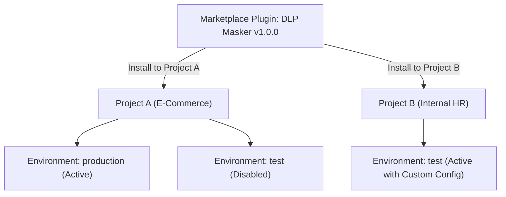

# Installation & Scope Isolation

Install capabilities from the marketplace with strict project and environment scope boundaries.

---

## Scope Isolation Principle

Capabilities installed in Naagmani never leak across unrelated workspaces:



1. **Targeted Workspace Installation**: You choose the exact Project and Environment (`test` or `production`) to attach the capability.
2. **Dedicated Environment Variables**: Configuration secrets (such as API keys or webhook URLs) are encrypted and isolated per environment.
3. **Independent Lifecycle Management**: Updating or uninstalling a plugin in `test` does not affect the `production` environment.

---

## Installing via Developer Portal

1. Navigate to **Organization > Marketplace** (`/marketplace`).
2. Select the desired item and click **Install**.
3. In the installation modal:
   - Select the target **Project**.
   - Select the target **Environment** (`test` or `production`).
   - Enter required environment configuration parameters.
4. Click **Confirm Installation**. The capability is downloaded, validated against its SHA-256 checksum, and initialized within < 2 seconds.

---

## Installing via CLI

```bash
naagmani marketplace install postgres-mcp-connector --project-id "proj_01J8F..." --environment "production"
```

---

## Related Documentation

- [Discover & Search](file:///e:/project/naagmani-project/naagmani-docs/docs/marketplace/discover.md)
- [Plugins & Local Tools](file:///e:/project/naagmani-project/naagmani-docs/docs/developer-portal/capabilities/plugins.md)
