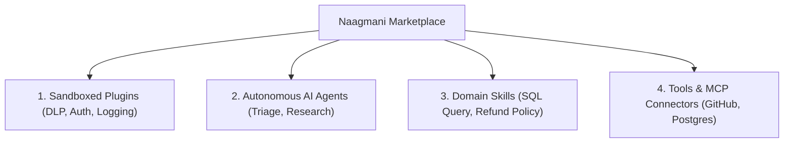

# Marketplace Overview

The **Naagmani Marketplace** is a centralized ecosystem for discovering, distributing, and installing modular AI capabilities, sandboxed plugins, domain skills, and tool extensions.

- **Portal Location**: `Organization > Marketplace` (`/marketplace`)
- **API Endpoint**: `/v1/marketplace`

---

## What is the Marketplace?

The Marketplace extends the core Naagmani AI Operating System by enabling developers to share and install pre-built capabilities without writing custom boilerplate integration code:

---

## Capability Categories

1. **Sandboxed Plugins**: Native Go, Node.js, and Python worker processes implementing the [Naagmani HDK](file:///e:/project/naagmani-project/naagmani-docs/docs/build/hdks/overview.md) wire protocol. They hook directly into the gateway's request/response pipeline.
2. **AI Agents**: Pre-configured reasoning agents with specialized system prompts and multi-tool orchestration workflows.
3. **Domain Skills**: Standardized procedural instructions and guidelines that can be attached to any project agent.
4. **Tools & Connectors**: Production-ready API bindings and external Model Context Protocol (MCP) server packages.

---

## Trust Verification & Security Scopes

Every item published to the marketplace undergoes automated security scanning:
- **Checksum Verification**: SHA-256 binary validation on all packaged release archives.
- **Manifest Permission Review**: Declared execution hooks (`pre_route`, `post_response`) and network egress boundaries are strictly verified.
- **Project Isolation**: Installing a plugin into `Project A` never automatically exposes that capability to `Project B` unless explicitly authorized.

---

## Next Steps

- Learn how to browse and filter catalog items: [Discover & Search](file:///e:/project/naagmani-project/naagmani-docs/docs/marketplace/discover.md)
- Learn how to install capabilities: [Installation & Scope Isolation](file:///e:/project/naagmani-project/naagmani-docs/docs/marketplace/installation.md)
- Learn how to distribute your own capabilities: [Publisher Portal](file:///e:/project/naagmani-project/naagmani-docs/docs/marketplace/publishing.md)
