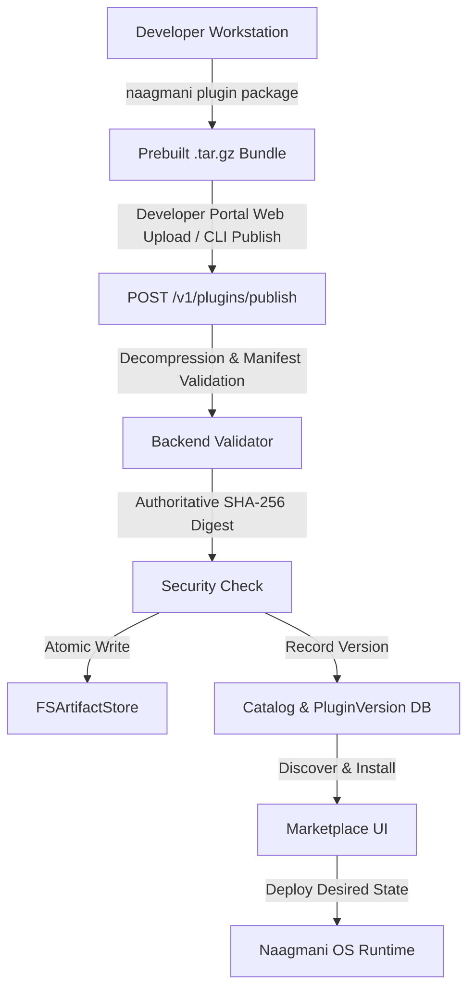

# Publishing to Marketplace

Share your AI plugins with your organization or the global Naagmani developer ecosystem.

---

## Publishing Workflow



---

## Publishing Options

### 1. Developer Portal Web Publisher
Navigate to `/publisher` in your Developer Portal workspace:
1. Specify Plugin Metadata and Visibility (`community`, `private`, or `official` if admin).
2. Enter SemVer tag and release changelog.
3. Upload prebuilt `.tar.gz` bundle produced by `naagmani plugin package`.
4. Review parameters and submit for server-side verification.

### 2. Naagmani CLI
Publish directly from terminal or CI/CD pipelines:
```bash
# 1. Authenticate
naagmani login

# 2. Publish prebuilt artifact
naagmani plugin publish ./dist/my-plugin-1.0.0.tar.gz --visibility community
```

---

## Artifact Ingestion & Integrity

The Naagmani Cloud backend is the authoritative entity for artifact validation:
- **Streaming Inspection**: Archive is decompressed and scanned in-memory with strict limits (max 50MB archive, max 200MB uncompressed, max 5,000 files) to prevent decompression bomb denial-of-service.
- **Manifest Conformance**: Root `plugin.json` must be present and comply with `naagmani.plugin/v1`.
- **Path Traversal Protection**: Any entries containing `..` or leading slashes are immediately rejected.
- **Authoritative SHA-256**: The server computes the true cryptographic SHA-256 digest during stream processing.
- **Version Immutability**: Existing versions cannot be replaced or overwritten.
