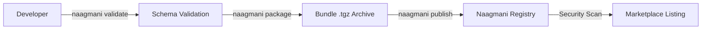

# Publishing to Marketplace

Share your custom plugins with the global Naagmani developer ecosystem.

---

## Publishing Workflow



---

## Step-by-Step Publishing Guide

### 1. Prepare Manifest & Documentation
Ensure your `plugin.json` contains comprehensive metadata:
- Clear description and author attribution.
- Valid `repository` and `homepage` URLs.
- Complete `config_schema` so the Portal can render a configuration UI.
- High quality `README.md` and `LICENSE`.

### 2. Validate Locally
```bash
naagmani validate --strict
```

### 3. Package & Publish
```bash
# Authenticate
naagmani login

# Publish publicly
naagmani publish --access public
```

---

## Automated CI/CD Publishing (GitHub Actions)

```yaml
name: Publish Plugin to Naagmani Marketplace
on:
  release:
    types: [published]

jobs:
  publish:
    runs-on: ubuntu-latest
    steps:
      - uses: actions/checkout@v4
      - uses: actions/setup-node@v4
        with:
          node-version: 20
      - run: npm install -g naagmani
      - run: naagmani validate --strict
      - run: naagmani publish --access public
        env:
          NAAGMANI_API_KEY: ${{ secrets.NAAGMANI_PUBLISH_TOKEN }}
```
