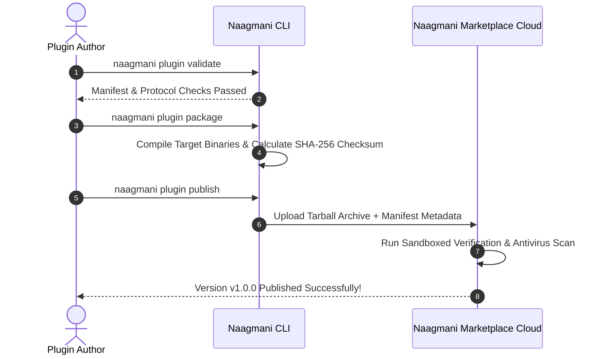

# Publisher Portal & Distribution

Package, sign, and publish custom plugins, agents, skills, and tools to your private organization or the public Naagmani Marketplace catalog.

- **Portal Location**: `Organization > Publisher` (`/publisher`)

---

## Visibility Scopes

When publishing an item, you choose its distribution reach:

| Visibility | Accessibility | Use Case |
|---|---|---|
| **Organization Private** | Visible only to projects and members within your authenticated Organization. | Proprietary enterprise integrations, internal database tools, corporate compliance plugins. |
| **Public Marketplace** | Available to all Naagmani developers worldwide after automated trust verification. | Open-source connectors, community tools, generic moderation filters. |

---

## Publishing Workflow via CLI

Publishing is fully automated using the Naagmani CLI:



```bash
# 1. Validate your plugin manifest
naagmani plugin validate .

# 2. Package into a distribution archive with checksum
naagmani plugin package .

# 3. Publish release version
naagmani plugin publish . --visibility organization
```

---

## Managing Releases in Developer Portal

1. In the sidebar, navigate to **Organization > Publisher** (`/publisher`).
2. Inspect published packages, active release versions, and install counts.
3. Deprecate legacy versions or yank releases in case of critical bugs.

---

## Related Documentation

- [HDK Plugin Packaging](file:///e:/project/naagmani-project/naagmani-docs/docs/build/hdks/publishing.md)
- [CLI Command Reference](file:///e:/project/naagmani-project/naagmani-docs/docs/build/cli/commands.md)
