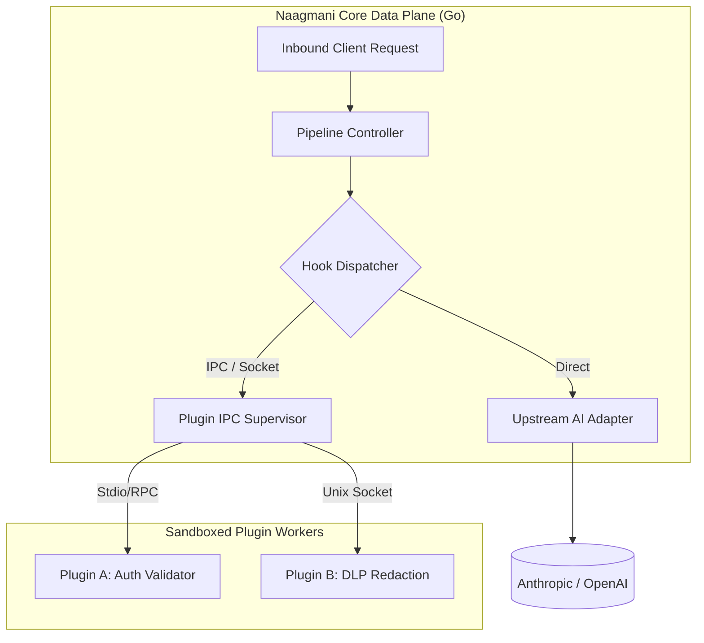
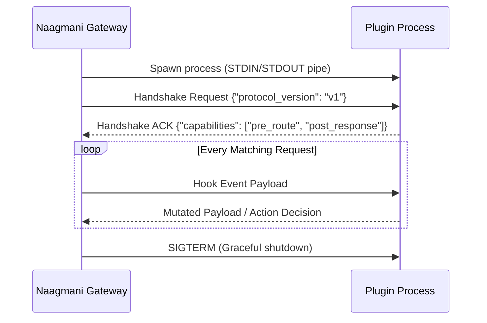

# Plugin Architecture & Isolation

Naagmani is designed with a **Micro-Kernel Gateway Architecture**. The core runtime handles transport multiplexing, token metering, and cryptographically verified vault access, while extensible logic is delegated to isolated worker processes known as **Hook Daemons**.

---

## Execution Isolation Models

Naagmani supports two execution runtimes for plugins:

### 1. Managed Subprocess (IPC / Stdio)
- **Languages:** Go, Python, Node.js, Rust.
- **Mechanism:** The Gateway forks the plugin binary and establishes high-speed bidirectional communication via standard input/output or Unix Domain Sockets.
- **Resource Constraints:** Process memory and CPU limits are enforced via OS-level cgroups / job objects.

### 2. WebAssembly (Wasm / WASI) *(Beta)*
- **Languages:** Rust, C, TinyGo.
- **Mechanism:** Direct embedded execution within the Gateway memory space using Wasmer/Wasmtime sandboxing.
- **Latency:** Sub-millisecond execution (< 0.2ms) with strictly sandboxed memory access.

---

## Failure Modes & Resilience

Every hook in your `plugin.json` can define its failure policy if the plugin daemon crashes, times out, or returns a 500 error:

| Mode | Gateway Action | Use Case |
| :--- | :--- | :--- |
| **`fail-close`** (Default) | The gateway terminates the client request with `502 Bad Gateway` and logs the hook crash in Audit Logs. | Security filters, DLP sanitizers, custom authorization checks. |
| **`fail-open`** | The gateway logs a warning, bypasses the failed hook, and proceeds with standard model routing. | Observability scrapers, non-critical analytics, experimental enrichment. |

---

## Lifecycle Overview

---

## Related Guides

- [Plugin Manifest Specification](/docs/plugins/manifest)
- [Plugin Lifecycle & Heartbeats](/docs/plugins/lifecycle)
- [Go Plugin Development (HDK)](/docs/sdk/go)
