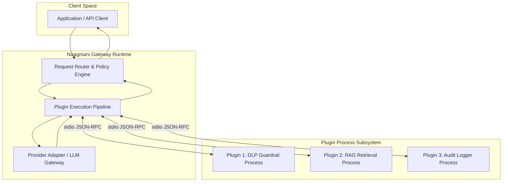

# Plugin Architecture

The Naagmani Plugin architecture separates the high-throughput inference runtime from plugin business logic via an asynchronous process-level IPC channel.

---

## High-Level Architecture

---

## Inter-Process Communication (IPC)

Plugins communicate using standard input (`stdin`) and standard output (`stdout`).

- **Framing**: Newline-delimited JSON-RPC 2.0 messages (`\n`).
- **Transport**: Standard POSIX / Windows process streams.
- **Diagnostics**: Plugins write human-readable diagnostic logs to standard error (`stderr`), which Naagmani routes to the centralized telemetry sink without corrupting the JSON-RPC channel.

---

## Performance & Latency

1. **Process Pooling**: Naagmani keeps plugin processes warm in a worker pool to eliminate startup cold starts.
2. **Streaming Hooks**: For streaming completions, plugins can inspect tokens in real-time or hook into stream lifecycle events (`on_token`, `on_complete`).
3. **Execution Timeouts**: Each hook invocation has a configurable timeout (default: 5,000ms). If a plugin exceeds its budget, the pipeline can either fail open (skip plugin) or fail closed (abort request) according to project policy.
