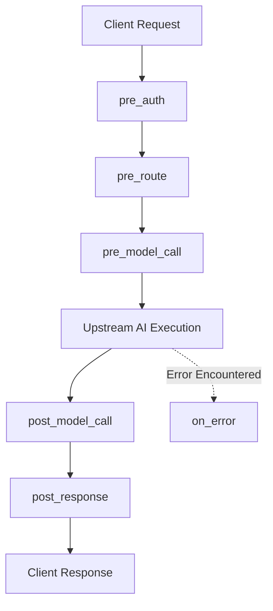

# Execution Hooks

Naagmani offers discrete hook interception points along the complete request/response lifecycle.

---

## Supported Hook Points

| Hook Name | When It Executes | Can Mutate Payload? | Common Use Cases |
| :--- | :--- | :--- | :--- |
| **`pre_auth`** | Before token validation and project context resolution. | Headers only | Custom JWT decryption, IP whitelisting. |
| **`pre_route`** | After project auth, before selecting the upstream provider/model. | Yes (Full) | Semantic routing, RAG context enrichment, PII masking. |
| **`pre_model_call`** | Immediately before dispatching payload to the selected provider adapter. | Yes (Provider payload) | Model-specific prompt formatting, token clipping. |
| **`post_model_call`** | Immediately after provider response or first stream chunk. | Yes | Output moderation, toxic content filtering. |
| **`post_response`** | Final stage before sending bytes to client. | Yes | Watermarking, telemetry calculation. |
| **`on_error`** | Triggered when upstream provider returns 4xx/5xx or timeouts. | Error payload | Custom error formatting, alert webhooks. |

---

## Hook Priority & Ordering

Multiple plugins can attach to the same hook point. They execute strictly ordered by their `priority` integer in descending order:

1. `Plugin A` (`priority: 100`)
2. `Plugin B` (`priority: 50`)
3. `Plugin C` (`priority: 10`)

Each plugin receives the output resulting from the preceding plugin in the pipeline.

---

## Next Steps

- [Permissions & Security](/docs/plugins/permissions)
- [Plugin Development Guide](/docs/plugins/development)
