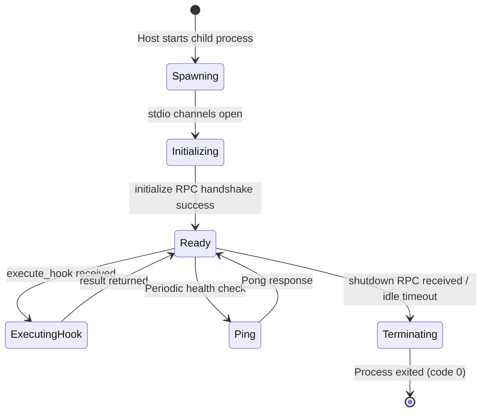

# Plugin Lifecycle

Understanding the lifecycle of a Naagmani plugin ensures robust handling of initialization, continuous execution, failure modes, and graceful teardown.

---

## Lifecycle Phases

---

## 1. Process Spawning & Handshake
- The Naagmani host launches the plugin executable as specified in `plugin.json` under `runtime.entrypoint`.
- The host immediately sends the `initialize` method payload over `stdin`.
- The plugin must respond with its metadata and confirmed capabilities within 2,000ms.

---

## 2. Request Processing Loop
- While in the `Ready` state, the host dispatches `execute_hook` calls as AI traffic moves through the gateway pipeline.
- The plugin processes the hook synchronously or asynchronously and outputs the JSON-RPC response on `stdout`.
- The host measures hook latency (`X-Naagmani-Plugin-Latency-Ms`).

---

## 3. Health Checks (`ping`)
- The host sends lightweight `ping` RPC messages during periods of inactivity to ensure the worker process remains responsive and has not leaked memory or deadlocked.

---

## 4. Teardown (`shutdown`)
- During gateway shutdown or plugin reload, the host sends the `shutdown` method.
- The plugin flushes any remaining background metrics or logs, closes open database or network sockets, and terminates cleanly with exit code `0`.
- If the plugin does not exit within 3,000ms after `shutdown`, the host terminates the process with `SIGKILL`.
