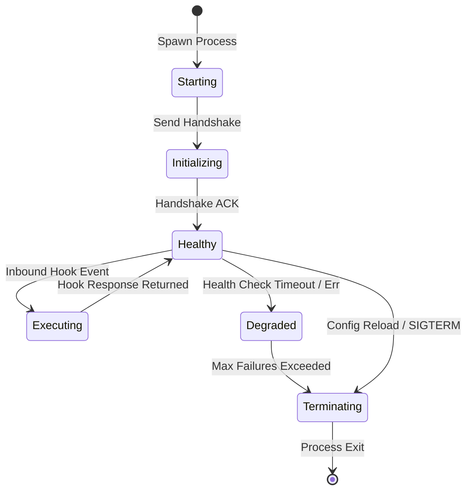

# Plugin Lifecycle & Process Management

Understanding how Naagmani spawns, monitors, hot-reloads, and cleanly terminates plugin daemons ensures zero-downtime operations and predictable latency.

---

## Lifecycle Stages



---

## 1. Process Boot & Handshake

When a project environment activates a plugin:
1. The gateway executes the `entrypoint` binary in a fresh execution context.
2. The gateway sets the environment variables (`NAAGMANI_ENV`, `PORTAL_API_URL`, `PROJECT_ID`).
3. The gateway issues an `init` JSON-RPC payload.
4. If the plugin fails to reply within **3000ms**, the gateway flags the plugin as `DEAD` and triggers the fallback policy.

---

## 2. Heartbeats & Health Checks

For native socket and RPC plugins, Naagmani dispatches a lightweight `ping` event every 15 seconds. If a plugin worker process stops responding:
- It is removed from the active routing ring.
- In-flight requests are rerouted according to the `on_failure` rule.
- A new replacement worker process is automatically spawned up to 3 retry attempts.

---

## 3. Hot Reloading Configuration

When an administrator updates plugin settings in the Developer Portal ([{{DEVELOPER_PORTAL_URL}}/plugins]({{DEVELOPER_PORTAL_URL}}/plugins)), Naagmani performs a **hot configuration push**:

```json
{
  "type": "config_update",
  "new_config": {
    "redact_ssn": true,
    "similarity_threshold": 0.85
  }
}
```

The plugin updates its internal state in-memory without dropping active connection streams.

---

## Next Steps

- [Plugin Execution Hooks](/docs/plugins/hooks)
- [Permissions & Security Model](/docs/plugins/permissions)
