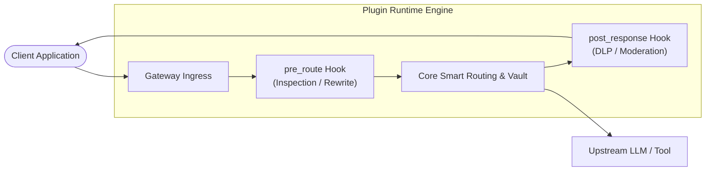

# Plugin System Overview

The **Naagmani Plugin System** empowers developers to extend the core AI gateway runtime with custom hooks, guardrails, policy filters, protocol translations, and real-time transform logic.

Built with an isolated, sandboxed execution model, plugins run alongside the high-throughput Go engine without compromising security or memory boundaries.



---

## Why Use Plugins?

While standard API gateways offer static configurations, modern enterprise AI workloads require programmatic, contextual interventions:

1. **Deterministic Guardrails & DLP:** Redact PII (Personally Identifiable Information) before it touches external third-party models.
2. **Context Enrichment & RAG Injection:** Intercept requests to dynamically attach enterprise knowledge chunks based on semantic embeddings.
3. **Custom FinOps Routing:** Inject proprietary cost-optimization heuristics or team quota counters.
4. **Tool/Protocol Bridging:** Seamlessly transform internal RPC contracts into OpenAI-compatible tool specifications.

---

## Anatomy of a Plugin

A Naagmani plugin consists of three primary components:

| Component | Description | Reference |
| :--- | :--- | :--- |
| **Manifest (`plugin.json`)** | Metadata, capabilities, entrypoint binaries, and requested permissions. | [Plugin Manifest](/docs/plugins/manifest) |
| **Executable Hook Binary** | The compiled logic (Go, Rust, Python, or Node.js) communicating over the v1 Wire Protocol. | [Wire Protocol](/docs/plugins/protocol) |
| **Config Schema** | JSON schema defining user-configurable runtime parameters in the Developer Portal. | [Portal Settings](/docs/developer-portal/overview) |

---

## Architectural Principles

### 1. Sandboxed Isolation
Plugins run in dedicated, non-privileged child processes or WebAssembly (Wasm) runtimes. If a plugin panics or encounters an unhandled exception, the core gateway isolates the failure and falls back gracefully based on the plugin's configured failure mode (`fail-open` or `fail-close`).

### 2. Zero-Copy gRPC/IPC Protocol
All hook payloads (request buffers, response streams, attempt telemetry) are exchanged via high-speed Unix Domain Sockets or shared IPC pipes using standard Protocol Buffers, adding **< 1.2ms** median latency overhead.

---

## Quick Example: PII Redaction Filter

```json
{
  "name": "enterprise-dlp-filter",
  "version": "1.0.0",
  "description": "Scans and redacts SSNs and credit card numbers prior to model dispatch.",
  "entrypoint": "bin/dlp_hook",
  "hooks": ["pre_route", "post_response"],
  "permissions": ["request:read_body", "request:mutate_body"]
}
```

---

## Developer Portal Management

You can inspect, activate, configure, and monitor plugins directly from the Developer Portal:
- Navigate to **Plugins & Marketplace**: [{{DEVELOPER_PORTAL_URL}}/plugins]({{DEVELOPER_PORTAL_URL}}/plugins)

---

## Next Steps

- [Plugin Architecture & Isolation](/docs/plugins/architecture)
- [Plugin Manifest Specification](/docs/plugins/manifest)
- [Wire Protocol (v1)](/docs/plugins/protocol)
- [Go Plugin HDK Guide](/docs/sdk/go)
