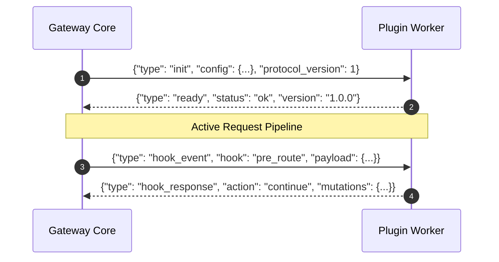

# Wire Protocol (v1)

Naagmani and its plugin worker processes communicate using a line-delimited JSON-RPC or Protocol Buffers protocol over standard streams (`stdin`/`stdout`) or Unix Domain Sockets.

---

## Protocol Lifecycle

1. **Initialization Handshake**: The gateway launches the plugin process and sends an `init` command.
2. **Readiness Probe**: The plugin responds with its negotiated capabilities and status.
3. **Event Execution Loop**: The gateway dispatches hook payloads and awaits completion messages.
4. **Shutdown Signal**: The gateway transmits a `shutdown` event before terminating the process.



---

## Frame Types

### 1. Init Message
```json
{
  "type": "init",
  "protocol_version": 1,
  "config": {
    "redact_ssn": true,
    "environment": "production"
  },
  "organization_id": "org_ad094812-07ef-4db5-b2ba-6585bd9df55e",
  "project_id": "prj_88194488-29a9-4081-b552-47514a60f601"
}
```

### 2. Hook Event Message
```json
{
  "type": "hook_event",
  "event_id": "evt_998124_1790355",
  "hook": "pre_route",
  "context": {
    "request_id": "req_klskuy2d3_1790355262227",
    "model": "gpt-4o",
    "token_id": "nst_live_9b2d8819..."
  },
  "payload": {
    "messages": [
      {
        "role": "user",
        "content": "My social security number is 000-12-3456."
      }
    ],
    "temperature": 0.7
  }
}
```

### 3. Hook Response Message
```json
{
  "type": "hook_response",
  "event_id": "evt_998124_1790355",
  "action": "continue",
  "mutations": {
    "messages": [
      {
        "role": "user",
        "content": "My social security number is [REDACTED_SSN]."
      }
    ]
  },
  "metadata": {
    "redaction_count": 1,
    "rule": "US_SSN"
  }
}
```

---

## Action Decision Types

| Action | Meaning |
| :--- | :--- |
| **`continue`** | Proceed to the next hook or upstream model with optional mutations. |
| **`short_circuit`** | Terminate the pipeline immediately and return the plugin's response directly to the client (e.g. cached response or guardrail rejection). |
| **`block`** | Terminate the request with an HTTP error code (e.g., `400 Bad Request` or `403 Forbidden`). |

---

## Next Steps

- [Plugin Lifecycle & Process Monitoring](/docs/plugins/lifecycle)
- [Plugin Development with Go HDK](/docs/sdk/go)
