# Observability & Monitoring

Naagmani provides deep visibility into LLM interactions, system health, plugin execution latencies, and token cost economics.

---

## OpenTelemetry (OTel) Integration

Naagmani emits standard OpenTelemetry spans and traces for every inference lifecycle event:

```mermaid
gantt
    title Request Trace Timeline (OTel Span)
    dateFormat  X
    axisFormat %s
    section Core Gateway
    Authenticate & Route :0, 5
    section Plugin Pipeline
    DLP Pre-Prompt Hook  :5, 12
    RAG Context Lookup   :12, 45
    section Upstream LLM
    Anthropic API Call   :45, 620
    section Output Pipeline
    Hallucination Check  :620, 635
```



### OTel Collector Configuration
```yaml
telemetry:
  opentelemetry:
    enabled: true
    endpoint: "otel-collector.monitoring:4317"
    protocol: "grpc"
    sampling_rate: 1.0 # 100% of traces in staging, 0.1 for high-volume prod
```

---

## Prometheus Metrics

The gateway exposes a `/metrics` Prometheus scrape endpoint providing:

| Metric Name | Type | Description |
| :--- | :--- | :--- |
| `naagmani_requests_total` | Counter | Total requests segmented by model, provider, and status code. |
| `naagmani_request_duration_seconds` | Histogram | Request latency distributions (p50, p95, p99). |
| `naagmani_prompt_tokens_total` | Counter | Total prompt tokens consumed. |
| `naagmani_completion_tokens_total` | Counter | Total completion tokens generated. |
| `naagmani_plugin_hook_duration_seconds` | Histogram | Execution time spent inside individual plugin hooks. |
| `naagmani_spend_usd_total` | Counter | Cumulative cost incurred across all providers. |
