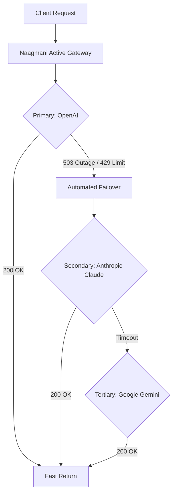

# High Availability & Failover

Naagmani ensures 99.99% uptime for AI workloads by automatically managing provider outages, rate-limit 429s, and network degradation.

---

## Smart Retry Strategies

1. **Exponential Backoff with Jitter**: Prevents thundering herd problems on upstream recovery.
2. **Circuit Breaker Pattern**: Temporarily halts traffic to failing providers to avoid latency cascades.
3. **Attempt Telemetry Tracking**: Logs every hop for automated SLA reporting.

---

## Next Steps

- [Rate Limiting & Quotas](/docs/production/rate-limits)
- [Traffic Routing Strategies](/docs/production/routing)
