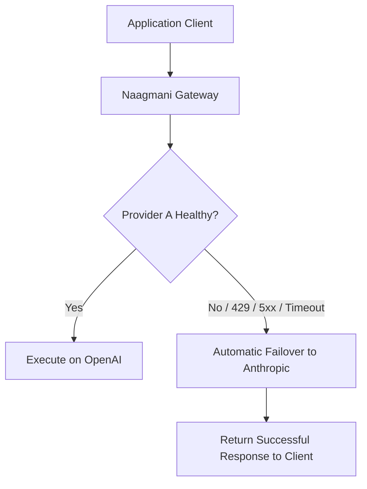

# High Availability & Reliability

Strategies for ensuring 99.99% availability for enterprise AI applications using Naagmani.

---

## Zero-Downtime Provider Failover

Upstream foundation model providers experience regular outages, degraded latency spikes, and transient 500 errors. Naagmani handles upstream failures transparently:



### Key Configuration
```yaml
routing_policy:
  failover:
    enabled: true
    max_retries: 2
    retry_statuses: [429, 500, 502, 503, 504]
    timeout_ms: 15000
```

---

## Circuit Breakers

When an upstream endpoint consistently fails (e.g. 5 errors in 10 seconds), Naagmani trips the circuit breaker for that provider, routing 100% of subsequent requests immediately to healthy backup providers without waiting for individual request timeouts.
