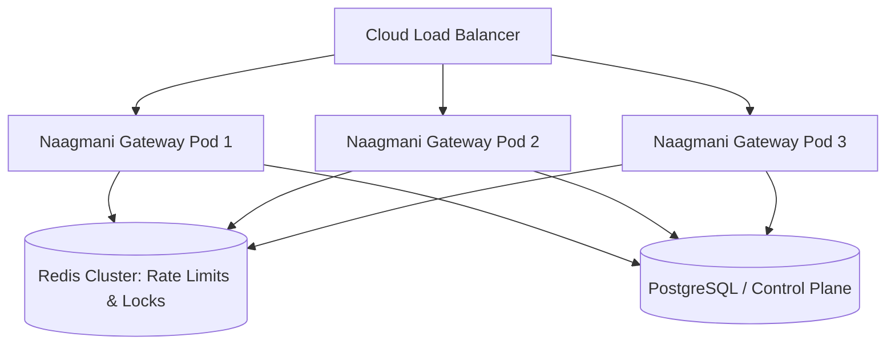

# Scaling & Concurrency

Architecting Naagmani clusters for hundreds of thousands of concurrent AI streams.

---

## Horizontal Scaling Architecture

Because the Data Plane Gateway is completely **stateless**, you can scale horizontally behind any standard Layer 4/Layer 7 Load Balancer (AWS ALB, NGINX, Cloudflare, Envoy).

---

## Performance Tuning Checklist

1. **OS File Descriptors**: Increase `ulimit -n 65535` for high-concurrency SSE connections.
2. **Keep-Alive Pooling**: Enable HTTP/2 connection reuse to upstream LLM providers.
3. **Memory Limits**: Allocate 512MB RAM per 10,000 active concurrent connections.

---

## Next Steps

- [Marketplace Overview](/docs/marketplace/overview)
- [Troubleshooting Common Errors](/docs/troubleshooting/common-errors)
