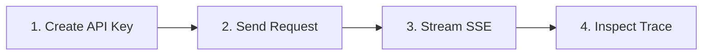

# Quickstart Overview

Welcome to Naagmani! In this quickstart guide, you will learn how to get up and running with Naagmani in under 5 minutes.

---

## Prerequisites

Before starting, ensure you have:
1. Access to the **Naagmani Developer Portal** (Local: `http://localhost:3000`, Hosted: `https://developer.naagmani.app`).
2. An active Organization and Project.
3. `curl`, Node.js (`>= 18`), Python (`>= 3.9`), or Go (`>= 1.21`) installed.

---

## Quickstart Steps

1. **[Create an API Key](api-key.md)**: Generate a scoped credential for your application.
2. **[Send Your First Request](first-request.md)**: Execute a standard OpenAI-compatible chat completion.
3. **[Stream Responses](streaming.md)**: Receive token-by-token responses using Server-Sent Events (SSE).
4. **[Inspect Execution Traces](provider-attempts.md)**: View real-time provider latency, tokens, and failover telemetry.

---

> [!TIP]
> **Zero SDK Migration Required**  
> Because Naagmani is 100% wire-compatible with the OpenAI API specification, you can use official OpenAI SDKs simply by changing the `baseURL`.
