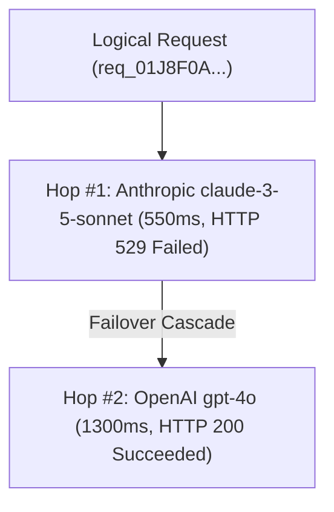

# Execution Trace & Telemetry

Every request processed by the Naagmani Gateway generates rich, discrete **Provider Attempt Telemetry**.

---

## What is a Provider Attempt?

When your application sends an inference request, Naagmani's Smart Router dispatches it to a primary upstream provider. If that provider encounters an error (e.g. HTTP 529 Anthropic Overloaded), Naagmani cascades to a fallback provider (e.g. OpenAI GPT-4o).

Naagmani records every single attempt in the cascade:
- **Attempt Index**: `0`, `1`, `2` (Hop sequence)
- **Upstream Duration & TTFT**: Exact milliseconds spent waiting for the model adapter.
- **Token Breakdown**: Exact Prompt, Completion, and Total tokens.
- **Calculated COGS**: Exact provider cost in USD based on official pricing versions.
- **Upstream Diagnostic**: Sanitized provider error codes and messages if failure occurred.



---

## Viewing Traces in Developer Portal

You can inspect provider attempt telemetry interactively:

1. Open the **Naagmani Developer Portal** at [{{DEVELOPER_PORTAL_URL}}/attempts]({{DEVELOPER_PORTAL_URL}}/attempts).
2. Browse the **Provider Attempt Accounting** table.
3. Click on any row or click **Cascade Chain** to slide open the **Execution Trace Inspector Drawer**.
4. Review the step-by-step ladder showing which provider failed, the exact error reason, and the final successful response.

---

## Querying Attempts via API

```bash
# List all recent provider attempts
curl -X GET "{{API_BASE_URL}}/v1/organizations/YOUR_ORG_ID/attempts?per_page=20" \
  -H "Authorization: Bearer YOUR_SESSION_TOKEN"

# Query the full cascade chain for a specific request ID
curl -X GET "{{API_BASE_URL}}/v1/organizations/YOUR_ORG_ID/requests/req_01J8F0A2B3C4D5E6F7G8H9J0K1/attempts" \
  -H "Authorization: Bearer YOUR_SESSION_TOKEN"
```

---

## Next Steps

- Learn how budget limits are enforced: [FinOps & Budget Hierarchy](../concepts/billing.md)
- Explore Developer Portal features: [Developer Portal Guide](../developer-portal/overview.md)
