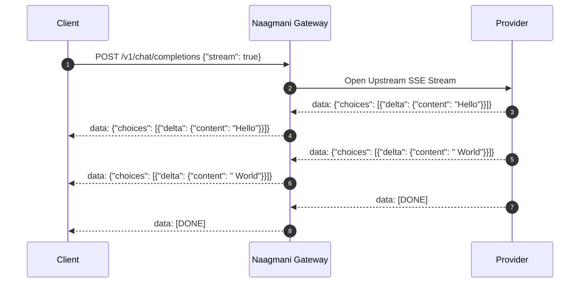

# Streaming Responses

Naagmani provides full support for real-time Server-Sent Events (SSE) streaming for ultra-responsive user interfaces.

---

## How Streaming Works

When `stream: true` is provided, the Naagmani Gateway establishes a persistent HTTP connection and forwards tokens downstream as they arrive from the upstream model provider.



---

## Code Examples

### 1. TypeScript / Node.js

```typescript
import OpenAI from "openai";

const client = new OpenAI({
  apiKey: process.env.NAAGMANI_API_KEY || "nsk_live_YOUR_KEY",
  baseURL: "http://localhost:8080/v1",
});

async function streamDemo() {
  const stream = await client.chat.completions.create({
    model: "claude-3-5-sonnet-20241022",
    messages: [{ role: "user", content: "Write a poem about distributed systems." }],
    stream: true,
  });

  for await (const chunk of stream) {
    const content = chunk.choices[0]?.delta?.content || "";
    process.stdout.write(content);
  }
  console.log("
--- Stream Finished ---");
}

streamDemo().catch(console.error);
```

---

### 2. Python

```python
from openai import OpenAI
import os

client = OpenAI(
    api_key=os.environ.get("NAAGMANI_API_KEY", "nsk_live_YOUR_KEY"),
    base_url="http://localhost:8080/v1"
)

stream = client.chat.completions.create(
    model="gpt-4o",
    messages=[{"role": "user", "content": "Explain quantum computing simply."}],
    stream=True
)

for chunk in stream:
    content = chunk.choices[0].delta.content
    if content:
        print(content, end="", flush=True)

print()
```

---

## Partial Streaming Token Accumulation

Naagmani automatically captures partial token usage during SSE streams:
- Tracks **Time to First Token (TTFT)**.
- Reconstructs accurate token counts even if the client disconnects prematurely.
- Accurately meters downstream costs against the tenant's spending budget.

---

## Next Steps

- Inspect streaming telemetry: [Execution Trace Telemetry](provider-attempts.md)
- Learn about model fallbacks: [Routing & Fallbacks](../concepts/routing.md)
