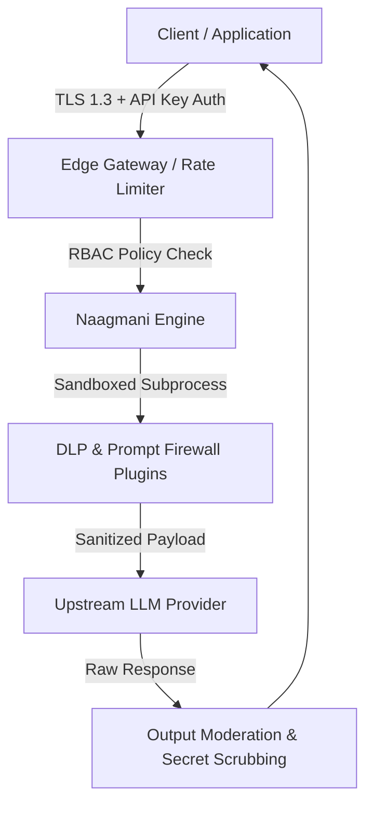

# Security Architecture & Overview

Security is a foundational pillar of the Naagmani AI Operating System. Designed from the ground up for zero-trust environments, Naagmani protects sensitive enterprise data, safeguards against malicious prompts, and enforces strict isolation across workloads.

---

## Defense-in-Depth Architecture

---

## Core Security Pillars

1. **Zero-Trust Authentication**: Every request is authenticated against cryptographically random, environment-scoped API keys with explicit permissions.
2. **Runtime Isolation**: Plugins execute in isolated, sandboxed sub-processes with least-privilege capability boundaries.
3. **Data Loss Prevention (DLP)**: Real-time masking and redaction of PII, secrets, API tokens, and internal identifiers before transmission to upstream model providers.
4. **Data Privacy & No Retention**: Client prompts and completions are streamed in-memory without persistent storage on gateway disks unless customer-configured audit archiving is explicitly enabled.
5. **Prompt Injection Defense**: Multi-layered heuristic and semantic filtering against jailbreak attempts and system prompt extraction attacks.
