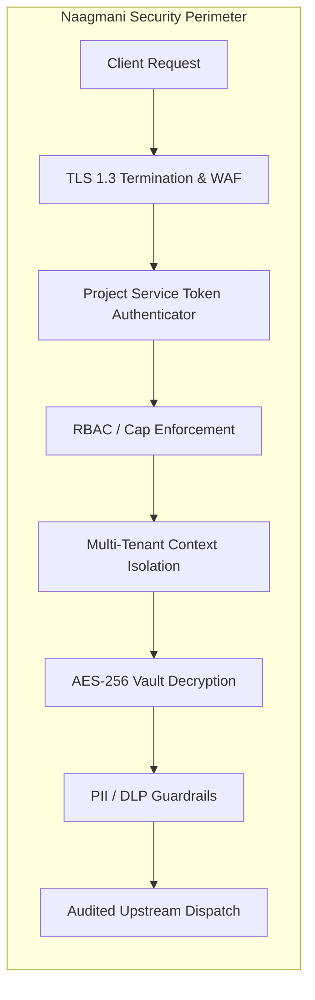

# Security & Governance Architecture

Security is the core architectural pillar of Naagmani. Designed for multi-tenant enterprise deployments, Naagmani guarantees absolute credential isolation, least-privilege token access, end-to-end payload encryption, and immutable audit logs.

---

## Security Highlights

1. **Hardware-Grade Cryptographic Vault**: Provider API keys and connection secrets are encrypted using AES-256-GCM with envelope encryption.
2. **Short-Lived Service Tokens**: Granular capabilities and automatic TTL expiration.
3. **Zero-Trust Network Model**: Master keys never leak to client code or plugin daemons.
4. **Comprehensive Audit Logs**: Every administrative configuration change and credential retrieval event is permanently journaled.

---

## Next Steps

- [Authentication & BYOK Model](/docs/security/authentication)
- [Role-Based Access Control (RBAC)](/docs/security/authorization)
- [Tenant Isolation & Sandboxing](/docs/security/isolation)
